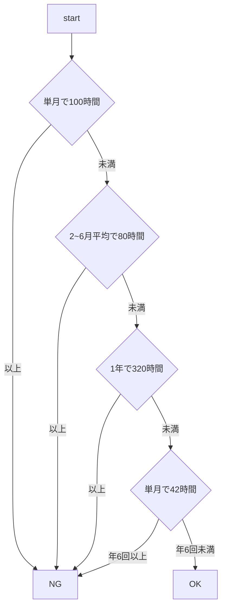

### 通常時

```mermaid
flowchart TD
    S[start]
    h100_in_month1{単月で100時間}
    h80_in_ave2_6{2~6月平均で80時間}
    h360_in_year1{1年で360時間}
    h45_in_month1{単月で45時間}
    NG[NG]
    OK[OK]
    S --> h100_in_month1
    h100_in_month1 -->|以上| NG
    h100_in_month1 -->|未満| h80_in_ave2_6
    h80_in_ave2_6 -->|以上| NG
    h80_in_ave2_6 -->|未満| h360_in_year1
    h360_in_year1 -->|以上| NG
    h360_in_year1 -->|未満| h45_in_month1
    h45_in_month1 -->|年6回以上| NG
    h45_in_month1 -->|年6回未満| OK
```

### 通常予見することのできない業務量の大幅な増加等に伴い臨時的に限度時間を超えて労働させる必要がある場合

年上限が360 -> 320時間に、月上限が45 -> 42時間に

```mermaid
flowchart TD
    S[start]
    h100_in_month1{単月で100時間}
    h80_in_ave2_6{2~6月平均で80時間}
    h320_in_year1{1年で320時間}
    h42_in_month1{単月で42時間}
    NG[NG]
    OK[OK]
    S --> h100_in_month1
    h100_in_month1 -->|以上| NG
    h100_in_month1 -->|未満| h80_in_ave2_6
    h80_in_ave2_6 -->|以上| NG
    h80_in_ave2_6 -->|未満| h320_in_year1
    h320_in_year1 -->|以上| NG
    h320_in_year1 -->|未満| h42_in_month1
    h42_in_month1 -->|年6回以上| NG
    h42_in_month1 -->|年6回未満| OK
```
