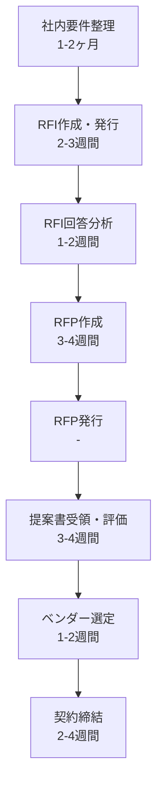

# システム開発を依頼する手順について

## 概要
システム開発を外部に依頼する際は、適切な手順を踏むことで、プロジェクトの成功確率を大幅に向上させることができます。特に重要なのは、RFI（情報提供依頼書）とRFP（提案依頼書）を効果的に活用し、正しい順序で進めることです。本資料では、システム開発を依頼する際の標準的な手順と、各フェーズでの重要ポイントを詳しく解説します。

## 1. システム開発依頼の基本プロセス

### システム開発依頼の全体像
- **定義**: 組織が外部のベンダー（システム開発会社）に対して、情報システムの開発を委託するための一連の手続き
- **目的**: 最適なベンダーを選定し、要求に合致したシステムを予算内・期限内に開発してもらうこと
- **重要性**: 適切な手順を踏むことで、プロジェクトの失敗リスクを大幅に低減できる

### 標準的なプロセスフロー
1. **社内での要件整理**
   - 現状の課題分析
   - システム化の目的明確化
   - 予算・スケジュールの大枠決定

2. **RFI（情報提供依頼書）の発行**
   - ベンダーの技術力・実績調査
   - 概算見積もりの取得
   - 実現可能性の確認

3. **RFP（提案依頼書）の作成・発行**
   - 詳細な要求仕様の提示
   - 評価基準の明確化
   - 正式な提案の募集

4. **ベンダー選定**
   - 提案内容の評価
   - プレゼンテーション実施
   - 最終的な発注先決定

## 2. RFI（Request for Information：情報提供依頼書）

### RFIの定義と目的
**定義**: 
- システム開発を検討している企業が、ベンダーに対して技術情報や概算見積もりなどの情報提供を依頼する文書
- 正式な発注前の情報収集段階で使用される

**主な目的**:
- ベンダーの技術力・実績の把握
- 実現可能性の確認
- 概算予算の把握
- 市場動向の理解

### RFIに含める内容

| 項目 | 内容 | 記載例 |
|------|------|---------|
| 会社概要 | 自社の基本情報 | 業種、規模、事業内容など |
| 背景・目的 | なぜシステム化が必要か | 現状の課題、期待する効果 |
| 想定システム概要 | 大まかなシステムイメージ | 主要機能、利用者数、データ量 |
| 情報提供依頼事項 | 知りたい情報の一覧 | 類似実績、技術提案、概算費用 |
| 回答期限 | いつまでに回答が必要か | 通常2-3週間程度 |
| 今後の予定 | RFP発行時期など | スケジュールの目安 |

### RFI作成時の注意点
- **具体性と抽象性のバランス**: 詳細すぎず、かつ曖昧すぎない記述
- **機密情報の取り扱い**: NDA（秘密保持契約）の締結検討
- **公平性の確保**: 複数ベンダーに同一内容で依頼
- **回答フォーマットの統一**: 比較しやすいよう様式を指定

## 3. RFP（Request for Proposal：提案依頼書）

### RFPの定義と目的
**定義**:
- システム開発の発注を前提として、ベンダーに対して具体的な提案を依頼する正式な文書
- 契約交渉の基礎となる重要文書

**主な目的**:
- 詳細な技術提案の取得
- 正確な見積もりの取得
- 契約条件の明確化
- ベンダー選定の判断材料収集

### RFPに含める内容

#### 必須項目一覧
1. **プロジェクト概要**
   - プロジェクト名称
   - 目的・背景
   - スコープ（範囲）
   - 期待される成果

2. **機能要件**
   - 業務要件
   - システム機能一覧
   - 画面・帳票要件
   - データ要件

3. **非機能要件**
   - 性能要件（レスポンスタイム等）
   - セキュリティ要件
   - 可用性要件（稼働率等）
   - 保守性要件

4. **プロジェクト管理要件**
   - 開発手法
   - 品質管理方法
   - 進捗報告方法
   - リスク管理方法

5. **契約条件**
   - 契約形態（請負/準委任）
   - 支払条件
   - 瑕疵担保責任
   - 知的財産権の帰属

### RFPの詳細構成例

```
1. はじめに
   1.1 本書の目的
   1.2 用語定義
   1.3 前提条件

2. プロジェクト概要
   2.1 背景と経緯
   2.2 現状の課題
   2.3 プロジェクトの目的
   2.4 期待される効果

3. 提案依頼事項
   3.1 提案範囲
   3.2 必須提案事項
   3.3 任意提案事項

4. システム要件
   4.1 業務要件
   4.2 機能要件
   4.3 非機能要件
   4.4 インフラ要件

5. プロジェクト要件
   5.1 スケジュール
   5.2 体制
   5.3 開発方法論
   5.4 品質保証

6. 提案手続き
   6.1 提案書提出期限
   6.2 質問受付方法
   6.3 選定プロセス
   6.4 評価基準

7. 契約条件
   7.1 契約形態
   7.2 費用・支払条件
   7.3 保証・責任範囲
   7.4 その他条件
```

## 4. RFIとRFPの適切な順序とタイミング

### 標準的な実施順序



### 各フェーズの所要期間目安

| フェーズ | 標準的な期間 | 主な作業内容 |
|---------|------------|------------|
| 社内要件整理 | 1-2ヶ月 | 現状分析、目的設定、予算確保 |
| RFI作成・発行 | 2-3週間 | RFI文書作成、ベンダーリスト作成 |
| RFI回答待ち | 2-3週間 | ベンダーによる情報整理期間 |
| RFI分析 | 1-2週間 | 回答内容の比較分析 |
| RFP作成 | 3-4週間 | 詳細要件定義、評価基準設定 |
| RFP回答待ち | 4-6週間 | ベンダーによる提案書作成期間 |
| 提案評価 | 3-4週間 | 書類審査、プレゼン実施 |
| 契約交渉 | 2-4週間 | 条件調整、契約書作成 |

### タイミングの重要ポイント

**RFI実施のベストタイミング**
- 予算策定の3-6ヶ月前
- 大まかな要件が見えてきた段階
- 複数の実現方法を検討したい時

**RFP実施のベストタイミング**
- 予算が確保された後
- 要件がある程度固まった段階
- プロジェクト開始の3-4ヶ月前

## 5. 具体的な実施例

### ケース1: 中堅製造業のERP導入プロジェクト

#### 背景
- **企業規模**: 従業員500名、年商100億円
- **課題**: 部門別システムの統合、業務効率化
- **予算**: 1億円程度を想定

#### RFI実施内容
**依頼先**: ERP導入実績のあるベンダー5社

**主な質問項目**:
1. 製造業向けERPの導入実績（過去3年、同規模企業）
2. 推奨するERPパッケージと選定理由
3. 標準的な導入期間と体制
4. 概算費用（初期費用、年間保守費用）
5. 導入後のサポート体制

**RFI結果**:
- A社: SAP推奨、8,000万円、導入期間8ヶ月
- B社: Oracle推奨、9,500万円、導入期間10ヶ月
- C社: 国産ERP推奨、6,000万円、導入期間6ヶ月

#### RFP実施内容
**対象**: RFI回答から3社を選定

**評価基準と配点**:
- 機能適合性（40点）
- 価格（30点）
- 導入実績（15点）
- サポート体制（15点）

**最終選定結果**: C社を選定
- 理由: コストパフォーマンスが高く、日本の製造業に特化した機能

### ケース2: 金融機関の顧客管理システム刷新

#### 背景
- **企業規模**: 地方銀行、預金残高5,000億円
- **課題**: レガシーシステムの保守限界、顧客サービス向上
- **予算**: 10億円規模

#### 段階的アプローチ

**第1段階: 予備調査（RFI前）**
- コンサルティング会社による現状分析
- 他行事例の調査
- 概算予算の算出

**第2段階: RFI実施**
- 対象: 金融システム開発実績のある大手ベンダー8社
- 重点確認事項:
  - 金融機関向けパッケージの有無
  - セキュリティ対策の実績
  - 24時間365日運用のサポート体制

**第3段階: RFP実施**
- 対象: RFIから4社に絞り込み
- 特記事項:
  - PoC（概念実証）の実施を要求
  - 段階的移行計画の提示を要求

## 6. よくある失敗パターンと対策

### 失敗パターン1: RFIを省略してRFPから開始

**問題点**:
- 市場価格が分からず予算設定を誤る
- 実現可能性の検証が不十分
- ベンダーの実力を見誤る

**対策**:
- 小規模案件でもRFIは実施する
- 最低3社以上から情報収集
- 概算見積もりに幅を持たせてもらう

### 失敗パターン2: RFPの要件が曖昧

**問題点**:
- 提案内容がバラバラで比較困難
- 契約後の認識齟齬
- 追加費用の発生

**対策**:
- 要件定義に十分な時間を確保
- 具体的な業務シナリオを記載
- 必須要件と希望要件を明確に区別

### 失敗パターン3: 評価基準が不明確

**問題点**:
- 恣意的な選定との批判
- 最適でないベンダーを選定
- 社内合意形成の困難

**対策**:
- RFP発行前に評価基準を確定
- 定量的な評価項目を設定
- 複数部門による評価委員会設置

## 7. 実務上の重要ポイント

### 文書作成のコツ

**RFI作成時**:
- シンプルで分かりやすい構成
- 技術的な前提を押し付けない
- 幅広い提案を受け入れる姿勢

**RFP作成時**:
- 詳細かつ具体的な記述
- 優先順位の明確化
- 制約事項の明記

### ベンダーコミュニケーション

**公平性の確保**:
- 全ベンダーに同じ情報を提供
- 質問と回答は全社で共有
- 個別相談は避ける

**効果的な情報収集**:
- 説明会の開催
- 質疑応答期間の設定
- 現場視察の機会提供

### 社内調整のポイント

**経営層の巻き込み**:
- 早期段階からの情報共有
- 投資対効果の明確化
- リスクの可視化

**現場部門との連携**:
- 要件定義への参画
- 評価プロセスへの関与
- 変更管理の重要性認識

## 8. 理解度確認クイズ（4択問題20問）

### 問題1
システム開発を外部に依頼する際、最初に行うべきことは何か？

- A) RFPを作成して複数のベンダーに送付する
- B) 社内で要件を整理し、課題と目的を明確化する
- C) ベンダーを1社選定して詳細な打ち合わせを行う
- D) 契約書のひな型を準備する

<details>
<summary>解答</summary>
<strong>正解: B</strong><br>
システム開発を依頼する前に、まず社内で現状の課題分析を行い、システム化の目的を明確にすることが重要です。これにより、後続のRFIやRFPの内容が具体的になり、プロジェクトの成功確率が高まります。<br>
<br>
Aが間違いの理由：RFPの前にRFIで情報収集すべき<br>
Cが間違いの理由：複数ベンダーから情報収集すべき<br>
Dが間違いの理由：契約は最終段階の作業
</details>

### 問題2
RFI（Request for Information）の主な目的として適切でないものはどれか？

- A) ベンダーの技術力や実績を把握する
- B) システム開発の概算費用を把握する
- C) 最終的な契約条件を確定する
- D) 技術的な実現可能性を確認する

<details>
<summary>解答</summary>
<strong>正解: C</strong><br>
RFIは情報収集段階の文書であり、契約条件の確定は行いません。契約条件の詳細な検討は、RFPを経てベンダー選定後に行います。<br>
<br>
Aは正しい：ベンダーの能力確認はRFIの主要目的<br>
Bは正しい：概算見積もりの取得はRFIの重要な目的<br>
Dは正しい：技術的実現可能性の確認もRFIで行う
</details>

### 問題3
RFIとRFPの実施順序として正しいものはどれか？

- A) RFP → RFI → ベンダー選定
- B) RFI → RFP → ベンダー選定
- C) RFPとRFIは同時に実施する
- D) 案件規模によって順序を変える

<details>
<summary>解答</summary>
<strong>正解: B</strong><br>
標準的な手順では、まずRFIで情報収集と概算見積もりを行い、その結果を踏まえてRFPで詳細な提案を求めます。この順序により、現実的で具体的なRFPを作成できます。<br>
<br>
Aが間違いの理由：RFIが先でRFPが後<br>
Cが間違いの理由：段階的に実施することで精度が向上<br>
Dが間違いの理由：基本的な順序は規模によらず同じ
</details>

### 問題4
RFPに必ず含めるべき内容として適切でないものはどれか？

- A) 機能要件と非機能要件
- B) 評価基準と選定プロセス
- C) ベンダーの希望販売価格
- D) プロジェクトのスケジュール

<details>
<summary>解答</summary>
<strong>正解: C</strong><br>
RFPは発注側が要求事項を提示する文書であり、ベンダーの希望価格を含める必要はありません。価格はベンダーからの提案書で提示されます。<br>
<br>
Aは必須：システムの要件定義は最重要項目<br>
Bは必須：公平な選定のため評価基準の明示が必要<br>
Dは必須：スケジュール要求の明確化が必要
</details>

### 問題5
RFI実施時の一般的な回答期限として適切なものはどれか？

- A) 3-5営業日
- B) 2-3週間
- C) 2-3ヶ月
- D) 6ヶ月以上

<details>
<summary>解答</summary>
<strong>正解: B</strong><br>
RFIの回答期限は通常2-3週間程度が適切です。ベンダーが社内で情報を収集し、概算見積もりを作成するのに必要十分な期間です。<br>
<br>
Aが間違いの理由：情報収集には短すぎる<br>
Cが間違いの理由：RFI段階では長すぎる<br>
Dが間違いの理由：プロジェクト全体が遅延する
</details>

### 問題6
企業がRFIを実施する最適なタイミングはいつか？

- A) システム開発開始の1週間前
- B) 予算策定の3-6ヶ月前
- C) 予算確定後すぐ
- D) システム設計完了後

<details>
<summary>解答</summary>
<strong>正解: B</strong><br>
RFIは予算策定の3-6ヶ月前に実施することで、概算費用を把握し、現実的な予算を設定できます。また、技術的な実現可能性も事前に確認できます。<br>
<br>
Aが間違いの理由：準備期間が全く不足<br>
Cが間違いの理由：予算策定にRFI情報を反映できない<br>
Dが間違いの理由：設計前に実施すべき
</details>

### 問題7
RFPの評価基準を設定する際、最も重要な考慮事項は何か？

- A) 価格を最重要視する
- B) 定量的に測定可能な基準を設定する
- C) ベンダーの企業規模を重視する
- D) 提案書のページ数で判断する

<details>
<summary>解答</summary>
<strong>正解: B</strong><br>
評価基準は可能な限り定量的に測定可能なものにすることで、客観的で公平な選定が可能になります。主観的な判断を最小限に抑えることが重要です。<br>
<br>
Aが間違いの理由：価格だけでなく品質等も重要<br>
Cが間違いの理由：規模より能力と実績が重要<br>
Dが間違いの理由：量より内容の質が重要
</details>

### 問題8
非機能要件に含まれないものはどれか？

- A) システムの応答時間
- B) データのバックアップ頻度
- C) 画面に表示する項目一覧
- D) システムの稼働率

<details>
<summary>解答</summary>
<strong>正解: C</strong><br>
画面に表示する項目一覧は機能要件に該当します。非機能要件は、性能、セキュリティ、可用性、保守性など、システムの品質に関する要件です。<br>
<br>
Aは非機能要件：性能要件に該当<br>
Bは非機能要件：運用要件に該当<br>
Dは非機能要件：可用性要件に該当
</details>

### 問題9
中堅企業（従業員300名）が基幹システムを更新する場合、RFIで確認すべき最重要事項は？

- A) ベンダーの資本金額
- B) 同規模企業への導入実績
- C) オフィスの所在地
- D) 社員の平均年齢

<details>
<summary>解答</summary>
<strong>正解: B</strong><br>
同規模企業への導入実績は、そのベンダーが自社の要求に対応できる能力があるかを判断する重要な指標です。類似案件の経験がプロジェクト成功に直結します。<br>
<br>
Aが間違いの理由：資本金より実績が重要<br>
Cが間違いの理由：場所より能力が重要<br>
Dが間違いの理由：年齢構成は選定に無関係
</details>

### 問題10
RFP作成時に「必須要件」と「希望要件」を分ける理由は何か？

- A) 文書を長くするため
- B) ベンダーが柔軟に提案できるようにするため
- C) 評価を複雑にするため
- D) 法的な義務があるため

<details>
<summary>解答</summary>
<strong>正解: B</strong><br>
必須要件と希望要件を分けることで、ベンダーは必須要件を満たしつつ、希望要件について創意工夫した提案ができます。これにより、より良い提案を引き出すことができます。<br>
<br>
Aが間違いの理由：簡潔性も重要<br>
Cが間違いの理由：むしろ評価を明確にする<br>
Dが間違いの理由：法的義務ではなく実務的な工夫
</details>

### 問題11
ある企業がRFIを5社に送付し、以下の概算見積もりを受領した。どの情報が最も注意すべきか？
- A社: 5,000万円（導入6ヶ月）
- B社: 4,800万円（導入6ヶ月）
- C社: 2,000万円（導入3ヶ月）
- D社: 5,200万円（導入8ヶ月）
- E社: 4,900万円（導入7ヶ月）

- A) A社とB社の見積もりが近い
- B) D社の導入期間が最も長い
- C) C社の見積もりが他社の半額以下
- D) E社が中間的な提案

<details>
<summary>解答</summary>
<strong>正解: C</strong><br>
C社の見積もりが他社の半額以下で導入期間も短いのは、要件の理解不足や品質面でのリスクがある可能性を示唆しています。詳細な確認が必要です。<br>
<br>
Aは正常：妥当な価格帯での競争<br>
Bは正常：慎重な進め方の可能性<br>
Dは特に問題なし：標準的な提案
</details>

### 問題12
RFP発行後、あるベンダーから「要件が不明確」という質問を受けた。適切な対応はどれか？

- A) そのベンダーだけに詳細説明を行う
- B) 質問内容と回答を全ベンダーに共有する
- C) 不明確な部分はベンダーの解釈に任せる
- D) そのベンダーを選定対象から外す

<details>
<summary>解答</summary>
<strong>正解: B</strong><br>
公平性を保つため、一社からの質問であっても、その内容と回答は全ベンダーに共有する必要があります。これにより、全社が同じ条件で提案できます。<br>
<br>
Aが間違い：公平性に欠ける<br>
Cが間違い：認識齟齬のリスク<br>
Dが間違い：正当な質問を排除すべきでない
</details>

### 問題13
金融機関がシステム更新でRFPを作成する際、特に重視すべき非機能要件は？

- A) 画面の色彩設計
- B) セキュリティ要件
- C) 帳票の用紙サイズ
- D) 社員の利用マニュアル

<details>
<summary>解答</summary>
<strong>正解: B</strong><br>
金融機関では顧客の重要な情報を扱うため、セキュリティ要件は最重要の非機能要件です。暗号化、アクセス制御、監査証跡などを詳細に定義する必要があります。<br>
<br>
Aは機能要件：重要度も低い<br>
Cは機能要件：詳細設計事項<br>
Dは成果物：非機能要件ではない
</details>

### 問題14
以下のプロジェクトスケジュールで問題があるものはどれか？

- A) RFI作成2週間 → RFI回答期間3週間 → RFP作成4週間
- B) RFP作成1日 → RFP回答期間6週間 → 評価3週間
- C) 要件定義2ヶ月 → RFI実施1ヶ月 → RFP実施2ヶ月
- D) RFI分析2週間 → RFP作成3週間 → 契約交渉3週間

<details>
<summary>解答</summary>
<strong>正解: B</strong><br>
RFP作成に1日は非現実的です。詳細な要件定義、評価基準の設定、契約条件の検討などに最低でも3-4週間は必要です。<br>
<br>
Aは適切：標準的なスケジュール<br>
Cは適切：大規模案件なら妥当<br>
Dは適切：RFP発行後の期間として妥当
</details>

### 問題15
製造業の企業が生産管理システムのRFIを実施した結果、パッケージ製品とスクラッチ開発の提案を受けた。評価の観点として最も重要なものは？

- A) 開発言語の種類
- B) 自社業務への適合度とカスタマイズ費用
- C) ベンダーの所在地
- D) システムの画面数

<details>
<summary>解答</summary>
<strong>正解: B</strong><br>
パッケージ製品は初期費用は安いが、業務に合わせたカスタマイズが必要な場合があります。自社業務への適合度と、必要なカスタマイズ費用の総額で判断することが重要です。<br>
<br>
Aは二次的：要件を満たせば言語は問わない<br>
Cは通常無関係：リモート対応可能<br>
Dは本質的でない：機能の充実度が重要
</details>

### 問題16
RFPの評価で、技術点が満点のA社（見積もり1億円）と、技術点が80%のB社（見積もり6,000万円）がいる。どのような判断基準を設けるべきか？

- A) 必ず技術点が高い方を選ぶ
- B) 必ず価格が安い方を選ぶ
- C) 費用対効果を定量的に評価する基準を設ける
- D) 経営者の直感で決める

<details>
<summary>解答</summary>
<strong>正解: C</strong><br>
技術点と価格のバランスを客観的に評価するため、費用対効果を定量化する基準（例：総合評価点＝技術点÷価格）を事前に設定し、透明性のある選定を行うべきです。<br>
<br>
Aが間違い：過剰品質の可能性<br>
Bが間違い：品質不足のリスク<br>
Dが間違い：客観性に欠ける
</details>

### 問題17
RFI段階で「導入後の保守費用は売上の3%程度」という回答を得た。この情報をどう解釈すべきか？

- A) 売上に連動する変動費として予算化する
- B) 一般的な保守費用率と比較して妥当性を検証する
- C) 3%は高すぎるので却下する
- D) パーセンテージではなく固定額を要求する

<details>
<summary>解答</summary>
<strong>正解: B</strong><br>
保守費用の妥当性は、業界標準や類似システムの事例と比較して判断する必要があります。システム投資額の10-15%/年が一般的なので、売上比3%が妥当かは自社の売上規模次第です。<br>
<br>
Aが間違い：通常は固定費的な性格<br>
Cが間違い：比較なしに判断できない<br>
Dも一理あるが：まず妥当性の検証が先
</details>

### 問題18
ベンダー選定委員会を設置する際、含めるべきでないメンバーは？

- A) 情報システム部門の責任者
- B) 利用部門の代表者
- C) 特定ベンダーと利害関係がある者
- D) 財務部門の担当者

<details>
<summary>解答</summary>
<strong>正解: C</strong><br>
公平な選定を行うため、特定ベンダーと利害関係がある者は選定委員会に含めるべきではありません。利益相反を避けることが重要です。<br>
<br>
Aは必須：技術的判断の中核<br>
Bは必須：要件の妥当性確認<br>
Dは必要：予算・契約面の確認
</details>

### 問題19
RFP回答提案書が200ページを超える大部なものだった場合、効率的な評価方法は？

- A) 全ページを全員で読む
- B) 評価項目ごとに担当を決めて分担評価する
- C) 最初の10ページだけ読む
- D) ページ数の多さを減点対象にする

<details>
<summary>解答</summary>
<strong>正解: B</strong><br>
大部な提案書は、評価項目（技術提案、プロジェクト管理、価格等）ごとに専門性を持つ担当者を決めて分担評価し、その後、全体会議で統合評価することが効率的です。<br>
<br>
Aは非効率：時間がかかりすぎる<br>
Cは不適切：重要情報を見逃す<br>
Dは不公平：内容で評価すべき
</details>

### 問題20
プロジェクト開始後、RFPに記載していなかった要件が発生した。適切な対応は？

- A) 口頭でベンダーに依頼する
- B) 変更管理プロセスに従い、文書で合意する
- C) 次回のプロジェクトで対応する
- D) RFPを書き直して再入札する

<details>
<summary>解答</summary>
<strong>正解: B</strong><br>
要件変更は必ず変更管理プロセスに従い、影響分析、見積もり、承認を経て、文書（変更管理票等）で両者合意することが重要です。これにより後々のトラブルを防げます。<br>
<br>
Aが間違い：証跡が残らずトラブルの元<br>
Cが間違い：必要な要件なら対応すべき<br>
Dが間違い：非現実的で時間の無駄
</details>

## 9. 専門用語集

### アルファベット

**NDA (Non-Disclosure Agreement)**
- **読み方**: エヌディーエー
- **意味**: 秘密保持契約。RFIやRFPで自社の機密情報を開示する前に、ベンダーと締結する契約。情報の目的外使用や第三者への開示を禁止する。
- **関連用語**: 機密保持契約、守秘義務契約

**PoC (Proof of Concept)**
- **読み方**: ピーオーシー、ポック
- **意味**: 概念実証。新しいアイデアや技術が実現可能かを検証するための小規模な実験やデモ。RFP段階で要求することがある。
- **関連用語**: パイロット、プロトタイプ

**RFI (Request for Information)**
- **読み方**: アールエフアイ
- **意味**: 情報提供依頼書。システム開発の初期段階で、ベンダーから技術情報、実績、概算見積もりなどを収集するための文書。
- **関連用語**: 情報提供要請、事前調査

**RFP (Request for Proposal)**
- **読み方**: アールエフピー
- **意味**: 提案依頼書。具体的な要件を示し、ベンダーから詳細な技術提案と正式見積もりを取得するための文書。
- **関連用語**: 提案要請、提案依頼

**RFQ (Request for Quotation)**
- **読み方**: アールエフキュー
- **意味**: 見積もり依頼書。仕様が明確な場合に、価格のみの見積もりを依頼する文書。RFPより簡易。
- **関連用語**: 見積もり要請、価格照会

**SLA (Service Level Agreement)**
- **読み方**: エスエルエー
- **意味**: サービスレベル合意。システムの稼働率、応答時間などの品質保証基準を定めた合意書。
- **関連用語**: サービス品質保証、運用レベル合意

### あ行

**アジャイル開発**
- **読み方**: あじゃいるかいはつ
- **意味**: 短期間の開発サイクルを繰り返し、柔軟に要件変更に対応する開発手法。RFPで開発手法として指定されることがある。
- **関連用語**: スクラム、反復型開発

**一括請負契約**
- **読み方**: いっかつうけおいけいやく
- **意味**: 成果物の完成を約束し、完成責任を負う契約形態。システム開発では最も一般的。
- **関連用語**: 請負契約、完成責任

**ウォーターフォール開発**
- **読み方**: うぉーたーふぉーるかいはつ
- **意味**: 要件定義→設計→開発→テストと順次進める従来型の開発手法。大規模システムで採用されることが多い。
- **関連用語**: 段階的開発、逐次開発

### か行

**瑕疵担保責任**
- **読み方**: かしたんぽせきにん
- **意味**: 納品後に発見された不具合（瑕疵）に対する修正責任。通常、検収後1年間などの期間を設定。
- **関連用語**: 不具合対応、保証期間

**概算見積もり**
- **読み方**: がいさんみつもり
- **意味**: RFI段階で提示される大まかな費用見積もり。正式見積もりとは異なり、参考値として扱う。
- **関連用語**: 概算費用、予算見積もり

**機能要件**
- **読み方**: きのうようけん
- **意味**: システムが実現すべき具体的な機能や業務処理に関する要件。画面、帳票、処理内容など。
- **関連用語**: 業務要件、機能仕様

**工数**
- **読み方**: こうすう
- **意味**: 作業に必要な人員×時間の総量。人月、人日などの単位で表現。見積もりの基礎となる。
- **関連用語**: 人月、作業量

### さ行

**準委任契約**
- **読み方**: じゅんいにんけいやく
- **意味**: 業務の遂行を約束する契約で、成果物の完成責任は負わない。コンサルティングなどで使用。
- **関連用語**: 委任契約、業務委託

**スコープ**
- **読み方**: すこーぷ
- **意味**: プロジェクトの対象範囲。RFPで明確に定義することで、範囲の認識齟齬を防ぐ。
- **関連用語**: 対象範囲、プロジェクト範囲

### た行

**妥当性確認**
- **読み方**: だとうせいかくにん
- **意味**: 要件や見積もりが適切かを検証すること。RFI回答の分析で重要な作業。
- **関連用語**: 検証、適正評価

### な行

**納期**
- **読み方**: のうき
- **意味**: システムやサービスを納品する期限。段階的な納期を設定することも多い。
- **関連用語**: 納品期限、デリバリー日程

### は行

**非機能要件**
- **読み方**: ひきのうようけん
- **意味**: 性能、信頼性、セキュリティなど、機能以外の品質に関する要件。
- **関連用語**: 品質要件、性能要件

**評価基準**
- **読み方**: ひょうかきじゅん
- **意味**: RFP回答を評価する際の基準と配点。事前に明確化することで公平な選定が可能。
- **関連用語**: 選定基準、評価指標

**ベンダー**
- **読み方**: べんだー
- **意味**: システムやサービスを提供する企業。システムインテグレーター（SIer）とも呼ばれる。
- **関連用語**: 供給業者、システム開発会社

### ま行

**見積もり**
- **読み方**: みつもり
- **意味**: プロジェクトに必要な費用を算出した文書。概算と正式見積もりがある。
- **関連用語**: 費用算出、コスト見積もり

### や行

**要件定義**
- **読み方**: ようけんていぎ
- **意味**: システムに求められる機能や性能を明確に定義する作業。RFP作成の基礎となる。
- **関連用語**: 要求定義、仕様定義

**予算**
- **読み方**: よさん
- **意味**: プロジェクトに割り当てられた費用枠。RFI結果を参考に設定することが多い。
- **関連用語**: 予算枠、投資額

### ら行

**リスク管理**
- **読み方**: りすくかんり
- **意味**: プロジェクトの潜在的な問題を特定し、対策を準備すること。RFPで管理方法を要求する。
- **関連用語**: リスクマネジメント、危機管理

### わ行

**ワークフロー**
- **読み方**: わーくふろー
- **意味**: 業務の流れや承認経路。システム化の対象となることが多い。
- **関連用語**: 業務フロー、業務プロセス