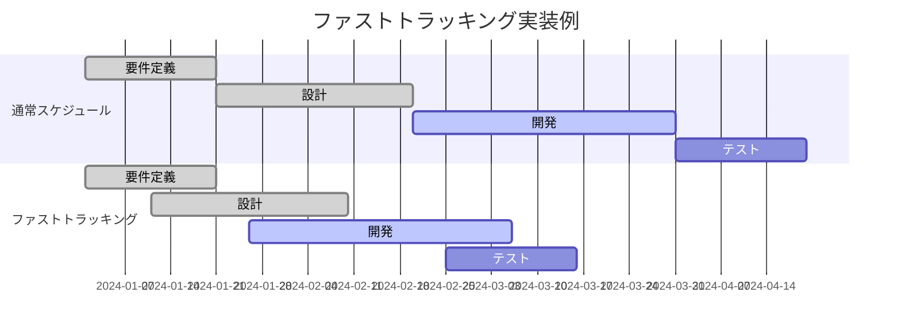

# スケジュールの短縮方法について

## 概要
プロジェクトマネジメントにおいて、予定されたプロジェクト期間を短縮することは、市場への迅速な製品投入、競争優位性の確保、コスト削減などの観点から重要な課題です。スケジュール短縮手法は、プロジェクトの品質を維持しながら、効率的に期間を圧縮するための体系的なアプローチを提供します。本資料では、代表的なスケジュール短縮手法であるファストトラッキング（Fast Tracking）とクラッシング（Crashing）について、その原理、適用方法、効果、リスクなどを詳細に解説します。

## 1. スケジュール短縮の基本概念・仕組み

### スケジュール短縮とは
- **定義**: プロジェクトの完了予定日を前倒しするために、計画されたアクティビティの実行方法を変更する手法
- **動作原理**: クリティカルパス上のアクティビティに焦点を当て、その期間を短縮または並行実行することで全体工期を圧縮
- **特徴**: 
  - プロジェクトのスコープは変更しない
  - 品質基準は維持する
  - リソースの追加投入や作業方法の変更を伴う

### 従来のプロジェクト実行との関係
- **従来技術との違い**: 順次実行から並行実行へ、標準リソースから追加リソース投入へ
- **改善点**: 市場投入の迅速化、機会損失の削減、競争優位性の確保
- **限界**: コスト増加、リスク増大、品質への潜在的影響

## 2. スケジュール短縮手法の種類・分類

### 分類軸
スケジュール短縮手法は、主に「作業の実行方法」と「リソースの投入方法」の2つの観点から分類されます。

### ファストトラッキング（Fast Tracking）
**特徴:**
- 本来順次実行する予定だったアクティビティを並行実行する
- 追加コストは最小限に抑えられる
- リスクが増大する可能性がある

**算出方法:**
```
短縮可能期間 = オーバーラップ可能な期間の合計
新しいプロジェクト期間 = 元の期間 - 短縮可能期間
```

**📊 具体的な計算例**
**例: システム開発プロジェクト**
- 要件定義: 20日
- 設計: 30日
- 開発: 40日
- テスト: 20日
- 合計: 110日（順次実行の場合）

**ステップ1: オーバーラップ可能な部分を特定**
```
要件定義の後半10日と設計の前半10日をオーバーラップ
設計の後半15日と開発の前半15日をオーバーラップ
開発の後半10日とテストの前半10日をオーバーラップ
```

**ステップ2: 新しいスケジュールを計算**
```
短縮期間 = 10日 + 15日 + 10日 = 35日
新しいプロジェクト期間 = 110日 - 35日 = 75日
短縮率 = 35日 ÷ 110日 × 100 = 31.8%
```

**結果: 110日から75日へ短縮（31.8%の期間短縮）**

💡 **実際の現場では**: 並行作業により手戻りリスクが増大するため、コミュニケーション強化とリスク管理が不可欠です。

### クラッシング（Crashing）
**特徴:**
- クリティカルパス上のアクティビティに追加リソースを投入
- コストが大幅に増加する
- 品質への影響を最小限に抑えやすい

**算出方法:**
```
クラッシングコスト = (短縮後コスト - 通常コスト) ÷ 短縮日数
最適なクラッシング = 最小コストで最大の短縮効果を得られる組み合わせ
```

**📊 具体的な計算例**
**例: 建設プロジェクト**
- 基礎工事: 通常30日（100万円）、最短20日（150万円）
- 躯体工事: 通常40日（200万円）、最短25日（300万円）
- 内装工事: 通常20日（80万円）、最短15日（120万円）

**ステップ1: 各アクティビティのクラッシングコストを計算**
```
基礎工事: (150万円 - 100万円) ÷ (30日 - 20日) = 5万円/日
躯体工事: (300万円 - 200万円) ÷ (40日 - 25日) = 6.67万円/日
内装工事: (120万円 - 80万円) ÷ (20日 - 15日) = 8万円/日
```

**ステップ2: コスト効率の良い順に短縮**
```
1. 基礎工事を10日短縮: 追加コスト50万円
2. 躯体工事を15日短縮: 追加コスト100万円
合計短縮期間: 25日
合計追加コスト: 150万円
```

**結果: 150万円の追加コストで25日の期間短縮を実現**

💡 **実際の現場では**: 人員の追加投入には限界があり、「人月の神話」に注意が必要です。

## 3. 詳細仕様・パラメータ

### ファストトラッキングの重要パラメータ
#### オーバーラップ率
- **意味**: 先行アクティビティと後続アクティビティの重複割合
- **設定範囲**: 0%～50%（通常）
- **影響**: 高いほど期間短縮効果大、リスクも増大
- **推奨値**: 20%～30%

#### 依存関係の強度
- **意味**: アクティビティ間の技術的・論理的依存度
- **設定範囲**: 強依存、中依存、弱依存
- **影響**: 弱いほどファストトラッキングが容易
- **推奨値**: 中依存以下のアクティビティを対象とする

### クラッシングの重要パラメータ
#### クラッシング係数
- **意味**: 追加投入リソースに対する期間短縮の効率性
- **設定範囲**: 0.5～0.8（通常）
- **影響**: 低いほど収穫逓減の法則が強く働く
- **推奨値**: 0.7以上を維持

#### 最大短縮可能期間
- **意味**: 技術的・物理的に短縮可能な限界
- **設定範囲**: 通常期間の50%～70%
- **影響**: 限界を超えると品質リスクが急増
- **推奨値**: 通常期間の70%を下限とする

## 4. 実装例・適用事例

### 基本実装（ファストトラッキング）


### 応用実装（ハイブリッド手法）
```
プロジェクト期間短縮計画:
1. クリティカルパス分析
   - CPMを使用してクリティカルパスを特定
   - フロート（余裕）のあるアクティビティを識別

2. ファストトラッキング適用
   - 依存関係の弱いアクティビティをオーバーラップ
   - リスク評価とミティゲーション計画策定

3. クラッシング適用
   - コスト効率の高いアクティビティから順次クラッシング
   - 品質チェックポイントの設定

4. モニタリングと調整
   - 週次でのプログレスレビュー
   - 必要に応じた計画の修正
```

### 実際の適用事例
#### 事例1: 大手IT企業のERPシステム導入プロジェクト
- **課題**: 競合他社に先駆けて新システムを導入する必要があった
- **適用方法**: 
  - 要件定義と設計フェーズを30%オーバーラップ
  - 開発フェーズに外部ベンダーを追加投入
- **結果**: 当初18ヶ月の予定を13ヶ月に短縮
- **効果**: 競合より3ヶ月早くシステムを稼働開始し、年間5億円の追加収益を獲得

#### 事例2: 建設会社の商業施設建設プロジェクト
- **課題**: テナント契約の関係で開業日を前倒しする必要が発生
- **適用方法**:
  - 基礎工事と躯体工事の一部を並行実施
  - 内装工事に夜間シフトを追加
- **結果**: 24ヶ月の工期を20ヶ月に短縮
- **効果**: 予定より4ヶ月早く開業し、クリスマス商戦に間に合わせることで初年度売上が20%増加

## 5. メリット・デメリット

### ファストトラッキングのメリット
**1. コスト効率性**
- **理由**: 追加リソースの投入が最小限で済む
- **効果**: 予算内でのスケジュール短縮が可能
- **具体例**: ソフトウェア開発で設計と開発を並行実施し、追加人件費なしで2週間短縮

**2. 柔軟性**
- **理由**: 作業の順序を調整するだけで実施可能
- **効果**: プロジェクトの進行中でも適用しやすい
- **具体例**: マーケティングキャンペーンで、クリエイティブ制作と媒体手配を並行実施

### ファストトラッキングのデメリット
**1. 手戻りリスクの増大**
- **理由**: 先行作業の成果物が確定する前に後続作業を開始
- **影響**: 変更が発生した場合の影響範囲が拡大
- **対策**: 頻繁なレビューとコミュニケーション強化

**2. 品質リスク**
- **理由**: 十分な検証時間が確保できない可能性
- **影響**: 不具合の見逃しや設計ミスの増加
- **対策**: 品質チェックポイントの追加設置

### クラッシングのメリット
**1. 確実性**
- **理由**: リソース投入により物理的に作業速度が向上
- **効果**: 計画通りの短縮が期待できる
- **具体例**: 製造ラインを2交代制から3交代制にして生産期間を30%短縮

**2. 品質維持**
- **理由**: 作業手順は変更せず、量的な対応で短縮
- **効果**: 品質基準を維持しやすい
- **具体例**: テスト要員を倍増してテスト期間を半減、カバレッジは維持

### クラッシングのデメリット
**1. コスト増大**
- **理由**: 追加リソースの調達・管理コストが発生
- **影響**: プロジェクト予算の大幅な増加
- **対策**: ROI分析による投資判断

**2. 収穫逓減**
- **理由**: リソース追加に対する効果が徐々に低下
- **影響**: 一定以上の短縮が困難
- **対策**: 最適投入量の事前シミュレーション

## 6. 選択・導入の指針

### スケジュール短縮手法の選択基準
| 観点 | ファストトラッキング | クラッシング | ハイブリッド |
|------|---------------------|--------------|--------------|
| コスト効率 | ◎ | △ | ○ |
| 短縮効果 | ○ | ◎ | ◎ |
| リスク | △ | ○ | ○ |
| 実施難易度 | ○ | ◎ | △ |
| 品質への影響 | △ | ○ | ○ |

### 適用判断フローチャート
1. **予算に余裕があるか？** 
   - Yes → クラッシングを優先検討
   - No → 次の判断へ

2. **アクティビティ間の依存関係は弱いか？**
   - Yes → ファストトラッキングを適用
   - No → 部分的なクラッシングまたは要求仕様の見直し

3. **品質要求は非常に高いか？**
   - Yes → クラッシングを選択
   - No → ファストトラッキングとクラッシングの組み合わせ

## 7. 最新動向・今後の展望
- **現在の課題**: アジャイル開発手法との統合、リモートワーク環境での適用方法の確立
- **研究動向**: AI/機械学習を活用した最適なスケジュール短縮案の自動生成
- **将来予測**: リアルタイムでのスケジュール最適化、動的リソース配分の自動化
- **関連技術**: クリティカルチェーンプロジェクトマネジメント（CCPM）、アジャイルプロジェクトマネジメント

## 8. 理解度確認クイズ（4択問題20問）

### 問題1
ファストトラッキングの基本的な定義として最も適切なものはどれか？

- A) プロジェクトのスコープを削減して期間を短縮する手法
- B) 本来順次実行する予定だったアクティビティを並行実行する手法
- C) 追加リソースを投入して作業速度を向上させる手法
- D) 品質基準を下げることで作業時間を短縮する手法

<details>
<summary>解答</summary>
<strong>正解: B</strong><br>
ファストトラッキングは、本来順次実行する予定だったアクティビティを並行実行することでスケジュールを短縮する手法です。<br>
<br>
Aが間違いの理由：スコープの削減は「スコープの縮小」という別の手法<br>
Cが間違いの理由：これはクラッシングの定義<br>
Dが間違いの理由：品質基準の変更は推奨されない方法<br>
<br>
【補足】実務では、依存関係の弱いアクティビティから優先的にファストトラッキングを適用します。
</details>

### 問題2
クラッシングを適用する際に最も重要な分析はどれか？

- A) ステークホルダー分析
- B) リスク分析
- C) クリティカルパス分析
- D) 品質分析

<details>
<summary>解答</summary>
<strong>正解: C</strong><br>
クラッシングはクリティカルパス上のアクティビティに対して適用することで、プロジェクト全体の期間を効果的に短縮できます。<br>
<br>
Aが間違いの理由：ステークホルダー分析は重要だが、クラッシング適用の前提条件ではない<br>
Bが間違いの理由：リスク分析は重要だが、まずクリティカルパスの特定が必要<br>
Dが間違いの理由：品質分析は事後的な確認要素<br>
<br>
【補足】クリティカルパス以外のアクティビティをクラッシングしても、プロジェクト全体の期間短縮にはつながりません。
</details>

### 問題3
あるアクティビティの通常期間が40日、通常コストが200万円、クラッシング後の期間が30日、クラッシング後のコストが280万円の場合、1日あたりのクラッシングコストはいくらか？

- A) 8万円/日
- B) 10万円/日
- C) 7万円/日
- D) 9.3万円/日

<details>
<summary>解答</summary>
<strong>正解: A</strong><br>
クラッシングコスト = (クラッシング後コスト - 通常コスト) ÷ 短縮日数<br>
= (280万円 - 200万円) ÷ (40日 - 30日)<br>
= 80万円 ÷ 10日<br>
= 8万円/日<br>
<br>
Bが間違いの理由：計算式を間違えている<br>
Cが間違いの理由：コストの差額を間違えている<br>
Dが間違いの理由：全体コストを期間で割る計算をしている<br>
<br>
【補足】このコストを他のアクティビティと比較して、最もコスト効率の良いものから順にクラッシングを適用します。
</details>

### 問題4
ファストトラッキングの最大のリスクは何か？

- A) コストの大幅な増加
- B) 手戻り作業の発生
- C) リソースの不足
- D) スケジュールの延長

<details>
<summary>解答</summary>
<strong>正解: B</strong><br>
ファストトラッキングでは、先行作業の成果物が確定する前に後続作業を開始するため、変更が発生した場合の手戻りリスクが最大の課題となります。<br>
<br>
Aが間違いの理由：ファストトラッキングは追加コストが最小限<br>
Cが間違いの理由：リソース追加は基本的に不要<br>
Dが間違いの理由：目的はスケジュール短縮なので矛盾<br>
<br>
【補足】手戻りリスクを軽減するため、頻繁なコミュニケーションと中間成果物のレビューが重要です。
</details>

### 問題5
プロジェクトマネージャーがスケジュール短縮手法を選択する際、最初に確認すべき事項は何か？

- A) 利用可能な予算
- B) チームメンバーのスキル
- C) クリティカルパスの特定
- D) ステークホルダーの要求

<details>
<summary>解答</summary>
<strong>正解: C</strong><br>
スケジュール短縮を効果的に行うには、まずクリティカルパスを特定し、どのアクティビティを短縮すればプロジェクト全体の期間が短縮されるかを把握する必要があります。<br>
<br>
Aが間違いの理由：予算は手法選択の制約条件だが、最初の確認事項ではない<br>
Bが間違いの理由：スキルは実施可能性の判断材料だが、クリティカルパス特定が先<br>
Dが間違いの理由：要求は重要だが、技術的な分析が先に必要<br>
<br>
【補足】クリティカルパスが特定できて初めて、効果的な短縮計画を立案できます。
</details>

### 問題6
ファストトラッキングとクラッシングの主な違いとして正しいものはどれか？

- A) ファストトラッキングは品質を犠牲にし、クラッシングは品質を維持する
- B) ファストトラッキングは作業順序を変更し、クラッシングはリソースを追加する
- C) ファストトラッキングは長期プロジェクト向け、クラッシングは短期プロジェクト向け
- D) ファストトラッキングは計画段階で実施、クラッシングは実行段階で実施

<details>
<summary>解答</summary>
<strong>正解: B</strong><br>
ファストトラッキングは作業の実行順序を変更（並行化）し、クラッシングは追加リソースを投入して作業を加速させる点が主な違いです。<br>
<br>
Aが間違いの理由：両手法とも品質維持を前提としている<br>
Cが間違いの理由：プロジェクト期間による使い分けではない<br>
Dが間違いの理由：両手法とも計画・実行の両段階で適用可能<br>
<br>
【補足】実務では両手法を組み合わせて使用することも多く、ハイブリッドアプローチと呼ばれます。
</details>

### 問題7
クラッシングのコスト効率を評価する際の指標として最も適切なものはどれか？

- A) 総コスト÷総期間
- B) 追加コスト÷短縮期間
- C) 短縮期間÷追加コスト
- D) 総コスト÷短縮期間

<details>
<summary>解答</summary>
<strong>正解: B</strong><br>
クラッシングのコスト効率は「追加コスト÷短縮期間」で評価し、1日あたりの追加コストを算出します。この値が小さいアクティビティから優先的にクラッシングを適用します。<br>
<br>
Aが間違いの理由：全体の平均コストであり、クラッシング効率を示さない<br>
Cが間違いの理由：逆数になっており、解釈が困難<br>
Dが間違いの理由：追加コストではなく総コストを使用している<br>
<br>
【補足】複数のアクティビティでこの指標を比較し、最小コストで最大の短縮効果を得られる組み合わせを選択します。
</details>

### 問題8
「人月の神話」がクラッシングに与える影響として正しいものはどれか？

- A) 人員を2倍にすれば期間は必ず半分になる
- B) 人員追加には限界があり、一定以上では効果が低下する
- C) 人員追加はコストに影響しない
- D) 人員追加により品質が必ず向上する

<details>
<summary>解答</summary>
<strong>正解: B</strong><br>
「人月の神話」は、人員を追加してもコミュニケーションコストの増加などにより、期待通りの生産性向上が得られない現象を指します。クラッシングでも同様の制約があります。<br>
<br>
Aが間違いの理由：これは「人月の神話」が否定している誤った考え方<br>
Cが間違いの理由：人員追加は必ずコスト増加を伴う<br>
Dが間違いの理由：人員追加と品質向上に直接的な相関はない<br>
<br>
【補足】実務では、チーム規模の最適化とコミュニケーション方法の工夫が重要です。
</details>

### 問題9
ファストトラッキングを適用する際のオーバーラップ率の推奨値はどの程度か？

- A) 0%～10%
- B) 20%～30%
- C) 50%～60%
- D) 70%～80%

<details>
<summary>解答</summary>
<strong>正解: B</strong><br>
一般的に、オーバーラップ率は20%～30%が推奨されます。この範囲であれば、適度な期間短縮効果を得ながら、手戻りリスクを管理可能なレベルに保てます。<br>
<br>
Aが間違いの理由：効果が小さすぎて実施する意味が薄い<br>
Cが間違いの理由：リスクが高すぎて管理が困難<br>
Dが間違いの理由：技術的に実現困難でリスクが極めて高い<br>
<br>
【補足】依存関係の強さによって適切なオーバーラップ率は変わるため、個別に評価が必要です。
</details>

### 問題10
スケジュール短縮手法を適用する際の制約条件として最も重要なものはどれか？

- A) プロジェクトスコープの維持
- B) チームメンバーの同意
- C) 文書化の完了
- D) 外部業者の確保

<details>
<summary>解答</summary>
<strong>正解: A</strong><br>
スケジュール短縮手法の大前提は、プロジェクトスコープを変更せずに期間を短縮することです。スコープを削減する場合は、別の意思決定プロセスが必要になります。<br>
<br>
Bが間違いの理由：重要だが、スコープ維持ほど本質的ではない<br>
Cが間違いの理由：文書化は並行して進められる<br>
Dが間違いの理由：クラッシングの場合のみ関連し、必須ではない<br>
<br>
【補足】スコープ、スケジュール、コストの三要素（トリプル制約）のバランスを常に意識することが重要です。
</details>

### 問題11
システム開発プロジェクトで、設計フェーズ（30日）と開発フェーズ（45日）を25%オーバーラップさせた場合、短縮される期間は何日か？

- A) 7.5日
- B) 11.25日
- C) 15日
- D) 18.75日

<details>
<summary>解答</summary>
<strong>正解: A</strong><br>
オーバーラップによる短縮期間は、先行アクティビティの期間×オーバーラップ率で計算します。<br>
設計フェーズ30日×25% = 7.5日<br>
<br>
Bが間違いの理由：開発フェーズの期間で計算している<br>
Cが間違いの理由：50%で計算している<br>
Dが間違いの理由：両フェーズの合計期間で計算している<br>
<br>
【補足】実際には、この7.5日分、設計の後半と開発の前半が並行して実施されます。
</details>

### 問題12
プロジェクトで以下のクラッシングオプションがある場合、最もコスト効率の良い選択はどれか？
- オプションA: 10日短縮で60万円の追加コスト
- オプションB: 8日短縮で40万円の追加コスト
- オプションC: 15日短縮で120万円の追加コスト
- オプションD: 5日短縮で20万円の追加コスト

- A) オプションA
- B) オプションB
- C) オプションC
- D) オプションD

<details>
<summary>解答</summary>
<strong>正解: D</strong><br>
各オプションの1日あたりのコストを計算します：<br>
オプションA: 60万円÷10日 = 6万円/日<br>
オプションB: 40万円÷8日 = 5万円/日<br>
オプションC: 120万円÷15日 = 8万円/日<br>
オプションD: 20万円÷5日 = 4万円/日<br>
オプションDが最もコスト効率が良いです。<br>
<br>
【補足】実務では、必要な短縮期間に応じて複数のオプションを組み合わせることもあります。
</details>

### 問題13
ファストトラッキングとクラッシングを組み合わせたハイブリッドアプローチの利点は何か？

- A) コストを完全に削減できる
- B) リスクをゼロにできる
- C) 各手法の欠点を補完できる
- D) 管理が簡単になる

<details>
<summary>解答</summary>
<strong>正解: C</strong><br>
ハイブリッドアプローチでは、ファストトラッキングのコスト効率性とクラッシングの確実性を組み合わせることで、各手法の欠点を補完し、バランスの取れた短縮計画を実現できます。<br>
<br>
Aが間違いの理由：クラッシング部分では必ずコストが発生する<br>
Bが間違いの理由：リスクは軽減できるが、ゼロにはならない<br>
Dが間違いの理由：2つの手法を併用するため、管理は複雑になる<br>
<br>
【補足】実務では、まずファストトラッキングで可能な限り短縮し、不足分をクラッシングで補うアプローチが一般的です。
</details>

### 問題14
クラッシングを実施する際の「収穫逓減の法則」とは何を意味するか？

- A) 期間短縮により品質が低下すること
- B) リソース追加に対する効果が徐々に低下すること
- C) コストが指数関数的に増加すること
- D) チームのモチベーションが低下すること

<details>
<summary>解答</summary>
<strong>正解: B</strong><br>
収穫逓減の法則は、リソース（人員など）を追加投入しても、その効果が徐々に低下する現象を指します。例えば、最初の人員追加では30%の短縮効果があっても、次の追加では15%、その次は7%と効果が減少します。<br>
<br>
Aが間違いの理由：品質低下は別の問題<br>
Cが間違いの理由：コスト増加は線形的または段階的<br>
Dが間違いの理由：心理的な問題であり、収穫逓減とは異なる<br>
<br>
【補足】この法則を考慮して、最適なリソース投入量を決定することが重要です。
</details>

### 問題15
建設プロジェクトで、基礎工事、躯体工事、内装工事がクリティカルパス上にあり、それぞれのクラッシングコストが5万円/日、7万円/日、10万円/日の場合、20日間短縮するための最小コストはいくらか？

- A) 100万円
- B) 120万円
- C) 140万円
- D) 200万円

<details>
<summary>解答</summary>
<strong>正解: A</strong><br>
コスト効率の良い順に短縮します：<br>
1. 基礎工事（5万円/日）で最大限短縮<br>
2. 次に躯体工事（7万円/日）<br>
3. 最後に内装工事（10万円/日）<br>
仮に基礎工事で20日すべて短縮可能なら：<br>
20日×5万円/日 = 100万円<br>
<br>
【補足】実際には各工事の最大短縮可能期間の制約があるため、それを考慮した組み合わせが必要です。
</details>

### 問題16
アジャイル開発プロジェクトでスケジュール短縮を行う場合、最も適切なアプローチはどれか？

- A) スプリント期間を短縮する
- B) スプリント内の作業を並行化する
- C) チーム規模を2倍にする
- D) スコープを各スプリントで削減する

<details>
<summary>解答</summary>
<strong>正解: B</strong><br>
アジャイル開発では、スプリント内の作業を並行化（ファストトラッキング的アプローチ）することで、品質とリズムを維持しながら効率を向上できます。<br>
<br>
Aが間違いの理由：スプリント期間の変更はチームのリズムを崩す<br>
Cが間違いの理由：大規模チームはコミュニケーションコストが増大<br>
Dが間違いの理由：スコープ削減は短縮手法ではない<br>
<br>
【補足】アジャイルでは、クロスファンクショナルチームの特性を活かした並行作業が効果的です。
</details>

### 問題17
ファストトラッキングを適用する前に実施すべきリスク対策として最も重要なものはどれか？

- A) 全メンバーの残業時間を増やす
- B) コミュニケーション計画の強化
- C) 予算の50%増額
- D) 外部監査の実施

<details>
<summary>解答</summary>
<strong>正解: B</strong><br>
ファストトラッキングでは並行作業が増えるため、情報共有の遅れや誤解を防ぐためのコミュニケーション計画の強化が最も重要です。<br>
<br>
Aが間違いの理由：残業増加は根本的な対策ではない<br>
Cが間違いの理由：ファストトラッキングは追加予算が最小限<br>
Dが間違いの理由：外部監査は事後的な確認手段<br>
<br>
【補足】日次スタンドアップミーティングや共有ダッシュボードの活用が効果的です。
</details>

### 問題18
プロジェクトの総工期が180日で、クリティカルパスの余裕が0日、非クリティカルパスの最小余裕が30日の場合、ファストトラッキングで最大何日まで短縮可能か？

- A) 0日
- B) 30日
- C) 60日
- D) 180日

<details>
<summary>解答</summary>
<strong>正解: B</strong><br>
ファストトラッキングでクリティカルパスを短縮しても、非クリティカルパスの余裕（30日）を超えて短縮すると、そちらが新たなクリティカルパスになるため、最大短縮可能期間は30日です。<br>
<br>
Aが間違いの理由：ファストトラッキングによる短縮は可能<br>
Cが間違いの理由：非クリティカルパスの制約を考慮していない<br>
Dが間違いの理由：プロジェクトを0日にすることは不可能<br>
<br>
【補足】複数のパスが存在する場合、すべてのパスを考慮した短縮計画が必要です。
</details>

### 問題19
クラッシング実施後のプロジェクトで最も注意すべき品質管理のポイントは何か？

- A) ドキュメントの量を増やす
- B) テスト期間を延長する
- C) 作業密度増加による見落としの防止
- D) 会議の回数を減らす

<details>
<summary>解答</summary>
<strong>正解: C</strong><br>
クラッシングにより作業密度が増加すると、チェックポイントの見落としや確認不足が発生しやすくなるため、これを防ぐための品質管理体制の強化が最も重要です。<br>
<br>
Aが間違いの理由：量より質の確保が重要<br>
Bが間違いの理由：期間短縮の目的に反する<br>
Dが間違いの理由：コミュニケーション削減は逆効果<br>
<br>
【補足】品質チェックリストの活用や、ピアレビューの強化が効果的です。
</details>

### 問題20
スケジュール短縮手法の選択において、組織の成熟度が与える影響として正しいものはどれか？

- A) 成熟度が低い組織ほどファストトラッキングが効果的
- B) 成熟度が高い組織ほどクラッシングのみを使用すべき
- C) 成熟度が高い組織ほど両手法を効果的に組み合わせられる
- D) 成熟度は手法選択に影響しない

<details>
<summary>解答</summary>
<strong>正解: C</strong><br>
組織の成熟度が高いほど、プロセスが確立され、コミュニケーションが円滑なため、ファストトラッキングとクラッシングを状況に応じて効果的に組み合わせることができます。<br>
<br>
Aが間違いの理由：成熟度が低い組織では並行作業のリスクが高い<br>
Bが間違いの理由：成熟した組織こそ柔軟な手法選択が可能<br>
Dが間違いの理由：成熟度は手法の成功率に大きく影響する<br>
<br>
【補足】組織のプロジェクトマネジメント成熟度モデル（PMMM）のレベルに応じた手法選択が重要です。
</details>

## 9. 専門用語集

このスライドで使用された専門用語について、アルファベット順・50音順で解説します。

### アルファベット

**CPM (Critical Path Method)**
- **読み方**: シーピーエム（クリティカルパスメソッド）
- **意味**: プロジェクトの各作業の依存関係を分析し、最長経路（クリティカルパス）を特定する手法。プロジェクト全体の最短完了時間を決定する。
- **関連用語**: クリティカルパス、PERT、ネットワーク図

**Fast Tracking**
- **読み方**: ファストトラッキング
- **意味**: 本来順次実行する予定のアクティビティを部分的に並行実行することで、プロジェクト期間を短縮する手法。
- **関連用語**: スケジュール短縮、オーバーラップ、並行処理

**Crashing**
- **読み方**: クラッシング
- **意味**: クリティカルパス上のアクティビティに追加リソースを投入することで、作業期間を短縮する手法。
- **関連用語**: リソース投入、コスト増加、期間短縮

**PERT (Program Evaluation and Review Technique)**
- **読み方**: パート
- **意味**: プロジェクトの作業時間を楽観値、最可能値、悲観値の3点見積もりで評価し、期待値を算出する手法。
- **関連用語**: 三点見積もり、CPM、確率的見積もり

**ROI (Return on Investment)**
- **読み方**: アールオーアイ（投資収益率）
- **意味**: 投資に対する収益の割合を示す指標。スケジュール短縮の投資判断に使用される。
- **関連用語**: 費用便益分析、投資判断、ビジネスケース

### あ行

**アクティビティ**
- **読み方**: あくてぃびてぃ
- **意味**: プロジェクトを構成する個々の作業単位。開始と終了が明確に定義され、所要期間が見積もられる。
- **関連用語**: タスク、作業、WBS

**オーバーラップ**
- **読み方**: おーばーらっぷ
- **意味**: 2つ以上のアクティビティが時間的に重なって実行されること。ファストトラッキングの基本的な実施方法。
- **関連用語**: 並行作業、ファストトラッキング、リードタイム

### か行

**クラッシングコスト**
- **読み方**: くらっしんぐこすと
- **意味**: アクティビティの期間を1単位（通常1日）短縮するために必要な追加コスト。
- **関連用語**: クラッシング、追加コスト、コスト勾配

**クリティカルチェーン**
- **読み方**: くりてぃかるちぇーん
- **意味**: リソースの制約を考慮したクリティカルパス。バッファマネジメントと組み合わせて使用される。
- **関連用語**: CCPM、バッファ、リソース制約

**クリティカルパス**
- **読み方**: くりてぃかるぱす
- **意味**: プロジェクトネットワーク図において、開始から終了までの最長経路。この経路上の遅延は必ずプロジェクト全体の遅延につながる。
- **関連用語**: CPM、フロート、スラック

**計画収束**
- **読み方**: けいかくしゅうそく
- **意味**: スケジュール短縮技法を適用して、目標期日に間に合うようにプロジェクト計画を調整すること。
- **関連用語**: スケジュール圧縮、計画調整

### さ行

**三点見積もり**
- **読み方**: さんてんみつもり
- **意味**: 楽観値、最可能値、悲観値の3つの値を用いて、より現実的な見積もりを行う手法。
- **関連用語**: PERT、期待値、標準偏差

**収穫逓減の法則**
- **読み方**: しゅうかくていげんのほうそく
- **意味**: 投入する資源を増やしても、それに比例して成果が増えず、効率が徐々に低下する経済学の法則。
- **関連用語**: 限界効用、効率性、最適化

**人月の神話**
- **読み方**: にんげつのしんわ
- **意味**: ソフトウェア開発において、人員と期間が単純に交換可能であるという誤った考え方。フレデリック・ブルックスが提唱。
- **関連用語**: ブルックスの法則、コミュニケーションコスト

**スケジュール圧縮**
- **読み方**: すけじゅーるあっしゅく
- **意味**: プロジェクトのスコープを変更することなく、プロジェクト期間を短縮すること。
- **関連用語**: 期間短縮、ファストトラッキング、クラッシング

**スコープ**
- **読み方**: すこーぷ
- **意味**: プロジェクトで実施すべき作業の範囲。成果物とそれを生成するために必要な作業の総体。
- **関連用語**: WBS、要求事項、成果物

**スラック**
- **読み方**: すらっく
- **意味**: アクティビティが遅延してもプロジェクト全体の完了日に影響しない余裕時間。フロートとも呼ばれる。
- **関連用語**: フロート、余裕時間、トータルフロート

### た行

**トリプル制約**
- **読み方**: とりぷるせいやく
- **意味**: プロジェクトマネジメントにおける、スコープ・時間・コストの3要素の相互関係。1つを変更すると他の要素に影響する。
- **関連用語**: プロジェクト三角形、鉄の三角形

### は行

**バッファ**
- **読み方**: ばっふぁ
- **意味**: プロジェクトの不確実性に対処するために設けられる時間的な余裕。
- **関連用語**: プロジェクトバッファ、フィーディングバッファ、安全余裕

**ハイブリッドアプローチ**
- **読み方**: はいぶりっどあぷろーち
- **意味**: ファストトラッキングとクラッシングを組み合わせて使用するスケジュール短縮手法。
- **関連用語**: 複合手法、最適化アプローチ

**フロート**
- **読み方**: ふろーと
- **意味**: アクティビティの開始または終了を遅らせてもプロジェクトの完了日に影響しない時間的余裕。
- **関連用語**: スラック、余裕時間、フリーフロート

### ま行

**マイルストーン**
- **読み方**: まいるすとーん
- **意味**: プロジェクトの重要な節目となる時点。期間を持たないイベント。
- **関連用語**: チェックポイント、成果物納期、ゲート

### ら行

**リードタイム**
- **読み方**: りーどたいむ
- **意味**: 後続アクティビティを先行アクティビティの完了前に開始できる時間。ファストトラッキングで活用される。
- **関連用語**: ラグタイム、依存関係、オーバーラップ

**リスクマネジメント**
- **読み方**: りすくまねじめんと
- **意味**: プロジェクトの目標達成を阻害する可能性のある事象を特定、分析、対応する体系的なプロセス。
- **関連用語**: リスク分析、リスク対応、リスクレジスタ

**リソース平準化**
- **読み方**: りそーすへいじゅんか
- **意味**: プロジェクト期間中のリソース使用量を均一化する手法。ピーク需要を削減する。
- **関連用語**: リソース最適化、リソーススムージング

---

**専門用語集作成時の注意点:**
- **網羅性**: スライド内で使用した専門用語を漏れなく収録
- **正確性**: プロジェクトマネジメントの標準的な定義に準拠
- **関連性**: 関連する用語同士の関係を明確化
- **実用性**: 実務での使用場面を考慮した説明