# プロジェクト進捗管理について

## 目次
1. [概要](#概要)
2. [WBS（Work Breakdown Structure）](#wbswork-breakdown-structure)
3. [ガントチャート](#ガントチャート)
4. [トレンドチャート](#トレンドチャート)
5. [EVMS（Earned Value Management System）](#evmsearned-value-management-system)
6. [各手法の比較と適用場面](#各手法の比較と適用場面)
7. [実践的な活用方法](#実践的な活用方法)
8. [クイズセクション](#クイズセクション)

## 概要

プロジェクト進捗管理は、プロジェクトの計画立案から完了まで、効率的かつ効果的にプロジェクトを推進するための重要な管理活動です。適切な進捗管理により、プロジェクトの成功確率を大幅に向上させることができます。

本ドキュメントでは、プロジェクト進捗管理の4つの主要な手法について詳しく解説します：

- **WBS（Work Breakdown Structure）**：作業分解構成図
- **ガントチャート**：時間軸と作業を可視化するチャート
- **トレンドチャート**：進捗状況の傾向を分析するグラフ
- **EVMS（Earned Value Management System）**：出来高管理システム

これらの手法を組み合わせることで、包括的で効果的なプロジェクト管理が実現できます。

## WBS（Work Breakdown Structure）

### 定義と目的

WBS（Work Breakdown Structure：作業分解構成図）は、プロジェクトの全体的な作業範囲を階層的に分解し、管理可能な小さな作業単位（ワークパッケージ）に細分化する構造化された手法です。

**主な目的：**
- プロジェクトスコープの明確化
- 作業の漏れや重複の防止
- 責任範囲の明確化
- 工数見積もりの精度向上
- 進捗管理の基盤作成

### WBSの構造

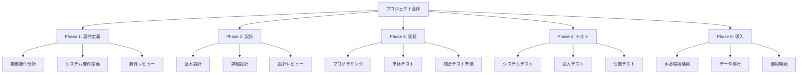

### WBS作成の原則

**100%ルール**
- 上位レベルの作業は、下位レベルの作業の合計と100%一致する必要がある
- 漏れや重複があってはならない

**階層の深さ**
- 一般的に3〜6階層程度が適切
- あまり深くしすぎると管理が複雑になる

**ワークパッケージの粒度**
- 最下位レベルは1〜2週間程度の作業量
- 責任者が明確に割り当てられる単位

### WBSの種類

#### 1. 成果物ベースWBS（Deliverable-based WBS）

**特徴：** プロジェクトが生み出す成果物（デリバラブル）を基準として作業を分解する手法

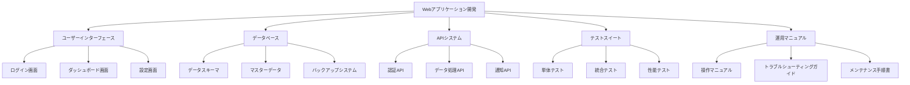

**適用場面：** 製品開発、建設プロジェクト、システム開発

**メリット：** 
- 最終成果物が明確に定義される
- 品質管理がしやすい（成果物ごとに品質基準を設定）
- 顧客との合意形成がしやすい

**デメリット：** 
- 作業プロセスの流れが見えにくい
- 作業間の依存関係が分かりにくい

#### 2. フェーズベースWBS（Phase-based WBS）

**特徴：** プロジェクトのライフサイクルフェーズを基準として作業を分解する手法

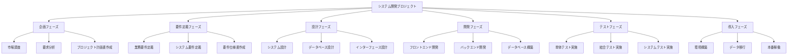

**適用場面：** システム開発、研究開発、コンサルティングプロジェクト

**メリット：** 
- プロジェクトの進行プロセスが明確
- 各フェーズでの成果物と判定基準が設定しやすい
- 段階的な進捗管理が可能

**デメリット：** 
- 成果物間の関連性が見えにくい
- フェーズ間での作業の重複や漏れが発生しやすい

#### 3. 組織ベースWBS（Organizational WBS）

**特徴：** プロジェクトに参加する組織や部門の責任範囲を基準として作業を分解する手法

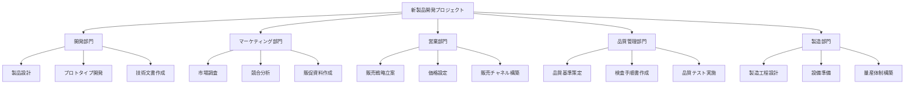

**適用場面：** 大規模プロジェクト、複数部門が関わるプロジェクト、アウトソーシングプロジェクト

**メリット：** 
- 各組織の責任範囲が明確
- 予算配分がしやすい
- 組織間の調整がしやすい

**デメリット：** 
- 作業間の関連性や依存関係が見えにくい  
- 組織の壁により情報共有が困難になりがち

#### WBS種類別比較表

| 種類 | 特徴 | 適用場面 | メリット | デメリット |
|------|------|----------|----------|------------|
| **成果物ベースWBS** | 成果物を基準に分解 | 製品開発、建設プロジェクト | 成果物が明確、品質管理しやすい | プロセスが見えにくい |
| **フェーズベースWBS** | プロジェクトフェーズを基準に分解 | システム開発、研究開発 | プロセスが明確、進捗管理しやすい | 成果物の関連性が見えにくい |
| **組織ベースWBS** | 組織構造を基準に分解 | 大規模プロジェクト | 責任範囲が明確 | 作業の関連性が見えにくい |

#### ハイブリッドアプローチ

実際のプロジェクトでは、複数のアプローチを組み合わせて使用することが多くあります：

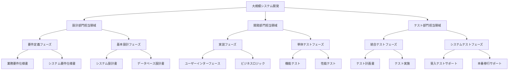

このように、上位レベルでは組織ベース、中位レベルではフェーズベース、下位レベルでは成果物ベースを組み合わせることで、各アプローチの利点を活用できます。

## ガントチャート

### 定義と特徴

ガントチャートは、プロジェクトのスケジュールを横棒グラフで表現する進捗管理ツールです。時間軸に対して各作業の開始日、終了日、期間、進捗状況を視覚的に表示します。

**主な特徴：**
- 時間軸による作業の可視化
- 作業間の依存関係の表現
- リソースの割り当て表示
- 進捗状況の一目での把握

### ガントチャートの構成要素

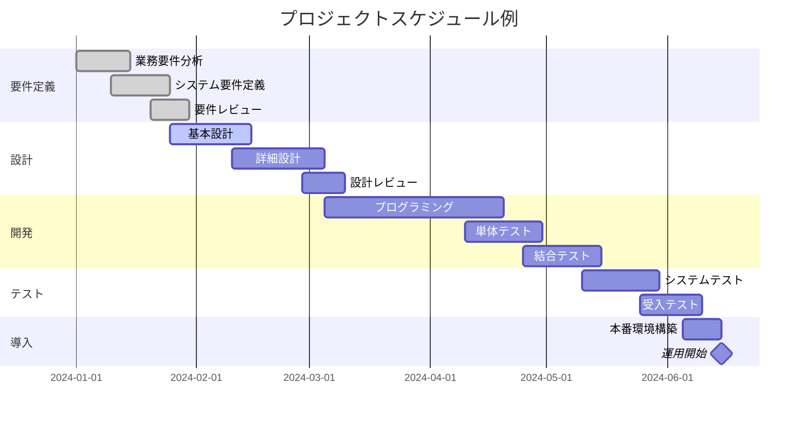

### ガントチャートの活用方法

#### 1. スケジュール管理での活用

**プロジェクト全体の期間把握**
- **具体的な使い方：** 開始日と終了日が明示されているため、プロジェクト全体の期間が一目で可視化されます
- **実践例：** チャート上で最初のタスクの開始日（例：2024年1月15日）から最後のタスクの終了日（例：2024年6月30日）までの期間を確認し、「このプロジェクトは5.5ヶ月で完了予定」と即座に把握
- **効果：** 納期に関する認識の統一、リソース計画の基礎情報提供

**各作業の開始・終了タイミング管理**
- **具体的な使い方：** 各タスクの横棒の左端が開始日、右端が終了日を表示し、作業間の時間的な関係が視覚的に把握できます
- **実践例：** 「要件定義（1/15-1/30）」の後に「基本設計（2/1-2/20）」が続き、5日間のバッファがあることを確認。遅れが発生した場合の影響範囲を即座に特定
- **効果：** 作業の重複や隙間時間の発見、適切なタイミングでのリソース投入

**クリティカルパスの特定**
- **具体的な使い方：** 依存関係のある作業チェーンの中で最も時間のかかる経路を赤色や太線で表示し、遅れが全体に影響する作業を明確化
- **実践例：** 「データベース設計→データ作成→テストデータ準備→結合テスト」の経路が最長期間（45日）であることを特定し、この経路の作業には最優先でリソースを配分
- **効果：** プロジェクト遅延の最大リスク要因の明確化、優先度の高い作業の特定

#### 2. リソース管理での活用

**人員配置の最適化**
- **具体的な使い方：** 各タスクに担当者名や必要人数を表示し、同時期に複数タスクを担当する人の負荷状況を色分けで可視化
- **実践例：** 田中さんが2月中旬に「詳細設計」と「レビュー準備」の両方にアサインされていることを発見。チャート上で重複期間を赤色表示し、片方を佐藤さんに再配分
- **効果：** リソース競合の事前発見、適切な負荷分散、チームメンバーの稼働率最適化

**作業負荷の平準化**
- **具体的な使い方：** リソースヒストグラム機能を使用して、期間別の必要工数をグラフ表示し、山谷のない均等な負荷分布を目指す
- **実践例：** 3月第2週に開発チーム全体で120時間/週の負荷集中を発見。一部タスクを2週間前倒しし、負荷を100時間/週に平準化
- **効果：** オーバーワークの防止、作業品質の向上、チームの持続可能な作業環境の確保

**スキル要件の事前確認**
- **具体的な使い方：** 各タスクに必要なスキル（例：Java開発、UI/UX設計）をタグ表示し、該当スキルを持つメンバーの空き状況を事前チェック
- **実践例：** 4月のセキュリティテスト実施時期に、セキュリティ専門知識を持つ山田さんが他プロジェクトで稼働中であることを2ヶ月前に発見。外部専門家の手配を早期に実施
- **効果：** スキル不足による作業停滞の防止、適切なタイミングでの専門家確保

#### 3. コミュニケーションでの活用

**ステークホルダーへの進捗報告**
- **具体的な使い方：** 完了した作業を緑色、進行中を黄色、未着手を灰色で表示し、現在の進捗率を視覚的に表現。予定との差異を一目で理解可能
- **実践例：** 月次報告会議で「全体の65%が完了、要件定義は100%完了、設計は80%完了、開発は30%完了」という状況をチャート上の色分けで3秒で説明
- **効果：** 非技術系ステークホルダーにも分かりやすい報告、意思決定の迅速化

**チーム内での情報共有**
- **具体的な使い方：** 共有ドライブにリアルタイム更新されるガントチャートを配置し、チーム全員が最新の進捗状況と今後の予定を常時確認可能
- **実践例：** 朝会で各メンバーが「今日は詳細設計書のレビューを完了予定、明日からコーディング開始」とチャートを見ながら状況共有。他メンバーも依存関係を即座に理解
- **効果：** 情報の非対称性解消、チーム全体の状況認識統一

**問題の早期発見と対応**
- **具体的な使い方：** 予定より遅れているタスクを赤色表示し、その遅れが後続タスクに与える影響を矢印の色変化で警告表示
- **実践例：** データベース設計が3日遅れた際、チャート上で後続の「テストデータ作成」「結合テスト」も自動的に3日後ろ倒しして表示。影響範囲を即座に把握し、回復策を検討
- **効果：** 問題の連鎖的影響の早期把握、迅速な対応策立案

### ガントチャートの限界と対策

#### 1. 複雑な依存関係の表現が困難

**限界の詳細：**
- **具体的な問題：** 作業Aが作業B、C、Dに依存し、さらに作業Dが作業Eの50%完了後に開始可能、といった複雑な条件関係は矢印だけでは表現が困難
- **実際の影響：** プロジェクト規模が大きくなると矢印が交錯し、依存関係が視覚的に把握できなくなる。特に100タスク以上のプロジェクトでは「スパゲッティ状態」になりがち
- **根本原因：** ガントチャートは時間軸での表現に最適化されており、論理的な依存関係の表現には構造的限界がある

**対策の詳細：**
- **ネットワーク図（PERT図）との併用**
  - **具体的な実施方法：** 計画段階でPERT図を作成して依存関係を整理し、その後ガントチャートで時間軸での管理を実施
  - **使い分け：** 複雑な依存関係の分析・説明時はPERT図、日常的な進捗管理はガントチャート
  - **効果：** 論理的整合性の確保と実用的な管理の両立

- **階層化による管理**
  - **具体的な実施方法：** 全体ガントチャート（20-30タスク）と詳細ガントチャート（各フェーズ50-80タスク）を分けて管理
  - **実践例：** 全体では「要件定義フェーズ」として1つのタスク、詳細では「業務要件分析」「システム要件定義」など10個のサブタスク

#### 2. 頻繁な変更に対する更新コストが高い

**限界の詳細：**
- **具体的な問題：** 1つのタスク変更が後続の全タスクの日程調整を必要とし、手動更新には数時間を要する場合がある
- **実際の影響：** 変更が発生する度にプロジェクトマネージャーが数時間チャート更新に費やし、本来の管理業務時間が圧迫される
- **根本原因：** リアルタイムでの自動調整機能の限界、特に複雑な制約条件下での自動スケジューリングの困難

**対策の詳細：**
- **定期的な更新とレビューの実施**
  - **具体的な実施方法：** 週次更新ルールを設定し、小さな変更は週末に一括更新、大きな変更は即座に更新
  - **効率化策：** 変更履歴をログに記録し、更新時に一覧で確認してから一括反映
  - **効果：** 更新作業の効率化と変更の影響範囲の明確化

- **ツールの自動化機能活用**
  - **具体的な実施方法：** MS Project、Asana、Jiraなどの自動スケジューリング機能を活用し、制約条件を事前設定
  - **実践例：** 「タスクAが2日遅れた場合、後続タスクを自動的に2日後ろ倒し」のルールを設定
  - **効果：** 手動更新時間の80%削減、人的ミスの防止

#### 3. 不確実性の高い作業の表現が困難

**限界の詳細：**
- **具体的な問題：** 「研究開発フェーズは2-8週間の幅がある」「新技術の習得期間が読めない」といった不確実性をガントチャートの固定的な棒グラフでは表現困難
- **実際の影響：** 楽観的な見積もりに基づいたスケジュールが作成され、現実とのギャップが発生。特にアジャイル開発や研究開発プロジェクトで顕著
- **根本原因：** ガントチャートは確定的なスケジュール表現に最適化されており、確率的・範囲的な表現には適さない

**対策の詳細：**
- **バッファ時間の戦略的組み込み**
  - **具体的な実施方法：** 各タスクに20%のバッファ、フェーズ間に1週間のバッファ、プロジェクト全体に10%のコンティンジェンシーを設定
  - **実践例：** 「開発フェーズ」を8週間と見積もった場合、チャート上では10週間（8週間＋20%バッファ）で設定
  - **効果：** 不確実性への耐性向上、現実的なスケジュール設定

- **複数シナリオの準備**
  - **具体的な実施方法：** 楽観シナリオ（90%確率）、現実シナリオ（50%確率）、悲観シナリオ（10%確率）の3つのガントチャートを準備
  - **実践例：** 新技術導入プロジェクトで「習得期間2週間/4週間/8週間」の3パターンを事前作成
  - **効果：** 状況変化への迅速な対応、リスク管理の向上

#### 4. 進捗の質的側面が見えない（追加の限界）

**限界の詳細：**
- **具体的な問題：** 「プログラミング80%完了」と表示されても、残り20%が最も困難な部分で実際は50%の工数が必要、といった質的な側面が見えない
- **実際の影響：** 見かけ上の進捗と実際の完了度にギャップが生じ、終盤での大幅な遅延が発生

**対策の詳細：**
- **マイルストーンベースの管理**
  - **具体的な実施方法：** 各タスクを複数のマイルストーン（確認ポイント）に分割し、デリバラブルベースで進捗を測定
  - **実践例：** 「プログラミング」を「基本機能実装完了」「エラーハンドリング実装完了」「テストケース通過」の3マイルストーンに分割
  - **効果：** より正確な進捗把握、問題の早期発見

## トレンドチャート

### 定義と目的

トレンドチャートは、プロジェクトの進捗状況を時系列で表示し、計画と実績の差異や将来の傾向を分析するためのグラフです。プロジェクトの健全性を継続的に監視し、早期警告システムとして機能します。

#### 主な目的の詳細解説

**1. 進捗の傾向分析**
- **具体的な目的：** プロジェクトが計画通りに進んでいるか、加速しているか、減速しているかを定量的に把握
- **実現方法：** 週次または月次で実際の進捗率を測定し、計画線と実績線の乖離状況を継続的に追跡
- **活用効果：** 「3週連続で進捗が計画を下回っている」「最近2週間で回復傾向にある」といった傾向の客観的把握により、感覚ではなくデータに基づく管理が可能

**2. 問題の早期発見**
- **具体的な目的：** 進捗の悪化傾向を定量的に検出し、問題が深刻化する前に察知
- **実現方法：** 許容範囲（例：計画値の±5%）を設定し、連続して範囲を逸脱した場合にアラートを発生
- **活用効果：** 従来の月次報告では発見が遅れがちな問題を、週次レベルで早期発見し、回復可能な段階での対策実施

**3. 将来予測の精度向上**
- **具体的な目的：** 過去の実績トレンドから将来の進捗予測を定量的に算出
- **実現方法：** 回帰分析やトレンドライン分析により、現在の傾向が継続した場合の完了予測日を算出
- **活用効果：** 「現在の進捗ペースだと2週間の遅延が予想される」といった具体的な予測により、事前の対策立案が可能

**4. 意思決定支援**
- **具体的な目的：** 客観的なデータに基づくプロジェクト判断の根拠提供
- **実現方法：** 複数の指標（進捗率、品質、コスト）を統合したダッシュボード形式での情報提供
- **活用効果：** 「リソース追加」「スコープ調整」「スケジュール変更」などの重要判断を、感覚ではなく定量的根拠に基づいて実施

### トレンドチャートの種類

**1. 進捗率トレンドチャート**

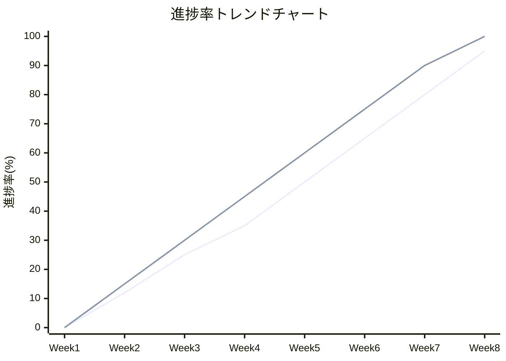

**2. 工数消費トレンドチャート**

**3. 課題・リスク発生トレンドチャート**

**4. 品質指標トレンドチャート**

### トレンドチャートの作成方法

#### ステップ1：データ収集の詳細手順

**1-1. 測定指標の定義**
- **進捗率の算出方法：** WBSの各ワークパッケージに重み付けを設定し、完了タスクの重みの合計を全体重みで除算
- **具体例：** 全50タスク中、重要度Aタスク（重み3）が10個、重要度Bタスク（重み2）が20個、重要度Cタスク（重み1）が20個の場合
  - 全体重み = 10×3 + 20×2 + 20×1 = 90
  - 重要度Aタスク5個完了時の進捗率 = (5×3) / 90 = 16.7%
- **測定頻度：** 週次測定（毎週金曜日17時時点）を推奨

**1-2. 一貫した測定基準の確立**
- **定義の統一：** 「完了」の定義を明確化（例：テスト済み、レビュー済み、承認済み）
- **測定者の訓練：** 複数人で測定する場合の基準統一のための測定者講習の実施
- **検証プロセス：** 測定結果の妥当性を複数人でクロスチェック

**1-3. データ収集の実務**
- **ツール活用：** Jira、Asana、Redmineなどのプロジェクト管理ツールから自動データ抽出
- **手動補正：** ツールでは把握できない質的な進捗状況（難易度、複雑さ）を手動で調整
- **記録方法：** ExcelまたはGoogle Sheetsでの時系列データ蓄積

#### ステップ2：分析と可視化

**2-1. 計画線の設定**
- **理想的な進捗曲線：** S字カーブ（開始時緩やか→中盤急勾配→終盤緩やか）での計画線設定
- **実践的な設定例：**
  - 0-2週目：10%進捗（立ち上がり期間）
  - 2-6週目：70%進捗（本格稼働期間）
  - 6-8週目：100%進捗（収束期間）

**2-2. 実績線のプロット**
- **データポイントの接続：** 直線接続ではなく、平滑化曲線（移動平均）を使用して傾向を明確化
- **異常値の処理：** 明らかな測定ミス（例：進捗率が前週比で大幅に減少）は除外または補正

**2-3. 分析指標の算出**
- **乖離度の定量化：** 各測定時点での計画値と実績値の差分を%で算出
- **傾向分析：** 直近3回の測定結果から傾向（改善/悪化/横ばい）を判定
- **予測計算：** 線形回帰分析により、現在の傾向が継続した場合の完了予測日を算出

#### ステップ3：レポート作成と活用

**3-1. 可視化の工夫**
- **線種ルール：** 計画線（実線）、実績線（点線）、予測線（破線）
- **警告表示：** 許容範囲（±5%）を灰色の帯で表示し、逸脱時にハイライト表示
- **トレンド矢印：** 改善傾向は上向き矢印、悪化傾向は下向き矢印を表示

**3-2. 定期レポート作成**
- **週次レポート：** 進捗状況、前週比変化、アクション要否の3点を1ページにまとめ
- **月次レポート：** 傾向分析、根本原因分析、改善策の効果検証を含む詳細レポート
- **エスカレーション基準：** 3週連続で計画値を5%以上下回った場合は経営層報告

### トレンドチャートの読み方・解釈方法

#### パターン1：順調な進捗パターン

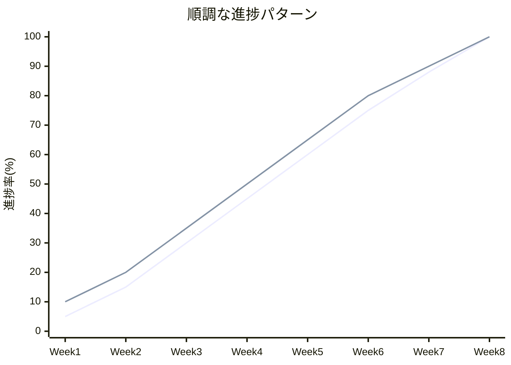

**チャートの読み方：**
- **実線（計画）と点線（実績）：** 実績が計画を若干上回って推移
- **解釈：** プロジェクトは健全に進行中、現在のペースを維持すれば予定通り完了
- **アクション：** 現状維持、チームのモチベーション維持に注力

#### パターン2：遅延発生パターン

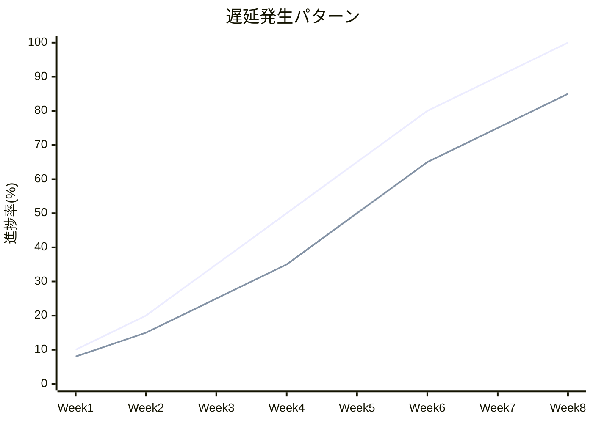

**チャートの読み方：**
- **実線（計画）と点線（実績）：** Week3以降、実績が計画を下回って乖離が拡大
- **解釈：** 構造的な問題が存在し、このままでは15%程度の遅延が予想される
- **アクション：** 原因分析の実施、リソース追加またはスコープ調整の検討

#### パターン3：回復傾向パターン

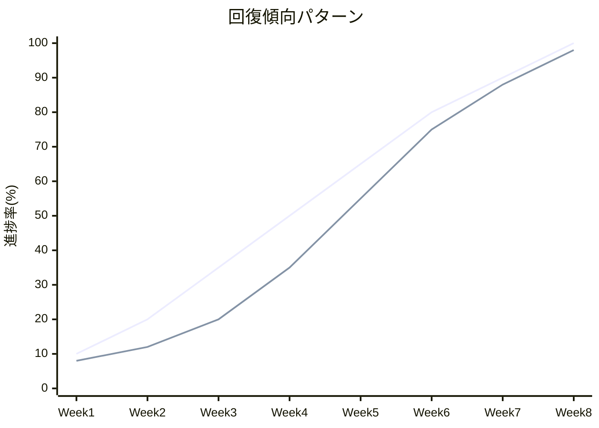

**チャートの読み方：**
- **実線（計画）と点線（実績）：** Week1-3で遅延、Week4以降に急回復
- **解釈：** 初期の問題を克服し、改善策が効果を発揮している
- **アクション：** 成功要因の分析と他プロジェクトへの展開

#### 解釈時の注意ポイント

**1. 単一データポイントでの判断回避**
- **誤った解釈例：** 1週間の進捗悪化で「プロジェクト失敗」と判断
- **正しい解釈：** 最低3回の連続データで傾向を判断

**2. 外部要因の考慮**
- **考慮すべき要因：** 祝日、メンバーの休暇、外部依存タスクの遅延
- **調整方法：** 外部要因による影響分を除外した「調整済み進捗率」で分析

**3. 質的側面との組み合わせ**
- **定量分析の限界：** 進捗率80%でも残り20%が最困難部分の可能性
- **補強方法：** チームメンバーからのヒアリングと組み合わせた総合判断

**4. アクションの優先順位付け**
- **緊急度判定：** 乖離度×影響範囲×回復難易度でアクションの優先順位を決定
- **リソース配分：** 限られたリソースを最も効果的な改善策に集中投入

## EVMS（Earned Value Management System）

### 定義と概念

EVMS（Earned Value Management System：出来高管理システム）は、プロジェクトのコスト、スケジュール、スコープを統合的に管理する手法です。計画価値（PV）、実績コスト（AC）、出来高（EV）の3つの基本指標を用いて、プロジェクトのパフォーマンスを定量的に評価します。

### EVMSの基本指標

**1. 計画価値（PV：Planned Value）**
- ある時点までに計画されていた作業の予算価値
- 別名：BCWS（Budgeted Cost of Work Scheduled）

**2. 出来高（EV：Earned Value）**
- ある時点までに実際に完了した作業の予算価値
- 別名：BCWP（Budgeted Cost of Work Performed）

**3. 実績コスト（AC：Actual Cost）**
- ある時点までに実際に消費したコスト
- 別名：ACWP（Actual Cost of Work Performed）

### EVMSの派生指標

#### 差異指標（Variance Indicators）

**コスト差異（CV：Cost Variance）**
```
CV = EV - AC
```

**詳細解説：**
- **意味：** 完了した作業に対して、予算との比較でどれだけコストの過不足があるかを示す
- **計算例：** EV=500万円、AC=600万円の場合 → CV = 500-600 = -100万円
- **解釈：**
  - **正の値（CV > 0）：** 予算内で作業が進行（コスト効率が良い）
    - 例：CV = +50万円 → 予定コストより50万円少ないコストで同じ作業を完了
  - **負の値（CV < 0）：** 予算超過（コスト効率が悪い）
    - 例：CV = -100万円 → 予定より100万円多くのコストがかかっている
- **アクション基準：** CV < -予算の5% の場合、コスト管理の見直しが必要

**スケジュール差異（SV：Schedule Variance）**
```
SV = EV - PV
```

**詳細解説：**
- **意味：** 計画に対して実際の作業進捗がどれだけ進んでいるか遅れているかを「価値」で表現
- **注意点：** 単位は「円」だが、これは時間的な遅れ/先行を価値で換算したもの
- **計算例：** EV=300万円、PV=400万円の場合 → SV = 300-400 = -100万円
- **解釈：**
  - **正の値（SV > 0）：** スケジュールより先行
    - 例：SV = +80万円 → 計画より80万円分の作業が先行して完了
  - **負の値（SV < 0）：** スケジュール遅れ
    - 例：SV = -100万円 → 計画より100万円分の作業が遅れている
- **実務的な意味：** SVが-100万円の場合、「100万円分の作業量が予定より遅れている」

#### 効率指標（Performance Indexes）

**コスト効率指数（CPI：Cost Performance Index）**
```
CPI = EV / AC
```

**詳細解説：**
- **意味：** 投入したコストに対してどれだけの価値（作業）を生み出せているかの効率
- **計算例：** EV=400万円、AC=500万円の場合 → CPI = 400/500 = 0.8
- **解釈：**
  - **CPI = 1.0：** 理想的な状態（計画通りの効率）
  - **CPI > 1.0：** コスト効率が良好
    - 例：CPI = 1.2 → 1円投入につき1.2円分の価値を創出（20%効率向上）
  - **CPI < 1.0：** コスト効率が悪化
    - 例：CPI = 0.8 → 1円投入につき0.8円分の価値しか創出できない（20%効率悪化）
- **管理基準：** CPI < 0.9の場合、コスト管理の抜本的見直しが必要

**スケジュール効率指数（SPI：Schedule Performance Index）**
```
SPI = EV / PV
```

**詳細解説：**
- **意味：** 計画された時間に対して実際にどれだけの作業を完了できているかの効率
- **計算例：** EV=350万円、PV=400万円の場合 → SPI = 350/400 = 0.875
- **解釈：**
  - **SPI = 1.0：** 計画通りの進捗
  - **SPI > 1.0：** スケジュール効率が良好（予定より早い）
    - 例：SPI = 1.15 → 計画の115%のペースで作業が進行
  - **SPI < 1.0：** スケジュール効率が悪化（予定より遅い）
    - 例：SPI = 0.875 → 計画の87.5%のペースでしか進捗していない
- **重要な特徴：** SPIはプロジェクト終了時には必ず1.0に収束する（全作業完了のため）

#### 複合指標の活用

**CSI（Cost Schedule Index）**
```
CSI = CPI × SPI
```
- **意味：** コストとスケジュールの総合的なパフォーマンス指標
- **解釈：** CSI < 0.8の場合、プロジェクトは深刻な問題を抱えている

### EVMSチャートの作成方法

#### ステップ1：基準値の設定

**1-1. BAC（Budget at Completion：完成時予算）の設定**
- **定義：** プロジェクト全体で承認された総予算
- **設定方法：** WBSの各ワークパッケージの予算を積み上げて算出
- **実例：** システム開発プロジェクトのBAC = 1,000万円

**1-2. PV曲線の作成**
- **データ作成：** 各時点での累計予算消費予定額を算出
- **具体的手順：**
  1. WBSの各タスクに予算と予定期間を設定
  2. ガントチャートベースで期間別の予算消費計画を作成
  3. 累計値をプロットしてPV曲線を生成
- **実例：** 6ヶ月プロジェクトの月次PV設定
  - Month1: 100万円, Month2: 250万円, Month3: 450万円
  - Month4: 700万円, Month5: 900万円, Month6: 1,000万円

#### ステップ2：実績データの収集と算出

**2-1. ACデータの収集**
- **収集方法：** 経理システム、タイムシート、購買システムから実際のコスト発生額を取得
- **注意点：** 間接費、共通費の配賦ルールを事前に明確化
- **集計頻度：** 週次または月次で実績コストを集計

**2-2. EVの算出**
- **進捗率法：** 各ワークパッケージの進捗率 × 予算額
- **マイルストーン法：** 完了したマイルストーンの予算額の合計
- **0/100法：** 完了したタスクのみカウント（未完了は0%）
- **実例：** 
  - タスクA（予算100万円、進捗80%）→ EV = 80万円
  - タスクB（予算50万円、完了）→ EV = 50万円
  - 合計EV = 130万円

#### ステップ3：チャートの作成と可視化

**3-1. 基本チャートの作成**

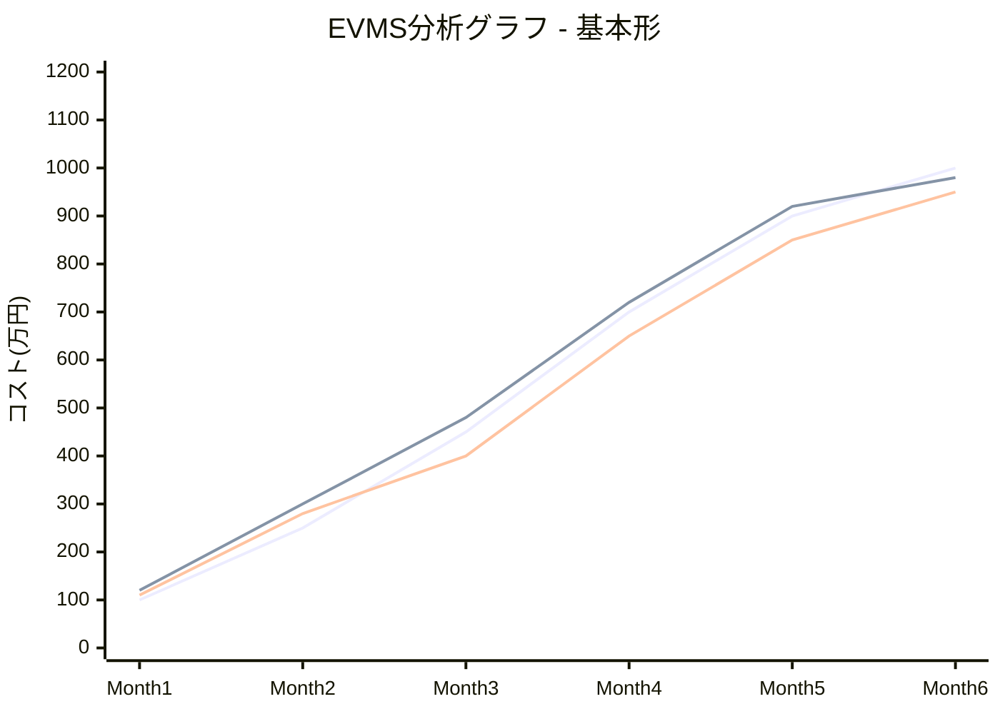

**3-2. 拡張チャート（差異表示付き）**

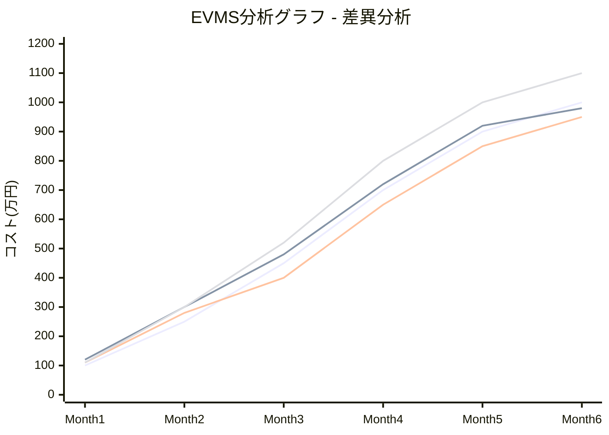

**線の意味：**
- **第1線（PV）：** 計画価値曲線
- **第2線（EV）：** 出来高曲線  
- **第3線（AC）：** 実績コスト曲線
- **第4線（EAC）：** 完成時コスト予測

### EVMSチャートの読み方・解釈方法

#### 基本的な読み方の手順

**ステップ1：3つの線の位置関係を確認**
1. **EVとPVの比較** → スケジュール状況の把握
2. **EVとACの比較** → コスト効率の把握
3. **ACとPVの比較** → 総合的な状況の把握

**ステップ2：具体的な数値分析**

**Month 4時点での分析例：**
- PV = 700万円（計画では700万円分の作業が完了予定）
- EV = 650万円（実際には650万円分の作業が完了）
- AC = 720万円（720万円のコストを消費）

**計算結果：**
- SV = EV - PV = 650 - 700 = -50万円（50万円分の作業が遅れ）
- CV = EV - AC = 650 - 720 = -70万円（70万円のコスト超過）
- SPI = EV / PV = 650 / 700 = 0.93（計画の93%のペース）
- CPI = EV / AC = 650 / 720 = 0.90（投入コストの90%の効率）

#### パターン別の読み方

**パターン1：理想的な状態（EV ≈ PV ≈ AC）**
- **状況：** 3つの線がほぼ重なって推移
- **解釈：** プロジェクトは計画通りに進行
- **アクション：** 現状維持、リスク監視の継続

**パターン2：スケジュール遅れ（EV < PV, AC ≈ PV）**
- **状況：** EV線がPV線の下方に位置
- **解釈：** 進捗が遅れているが、コスト効率は適正
- **アクション：** リソース追加、作業効率化の検討

**パターン3：コスト超過（EV ≈ PV, AC > EV）**
- **状況：** AC線がEV線の上方に位置
- **解釈：** 進捗は順調だが、コスト効率が悪化
- **アクション：** コスト管理の見直し、無駄の削減

**パターン4：複合問題（EV < PV, AC > EV）**
- **状況：** EV線が最も下方、AC線が最も上方に位置
- **解釈：** 進捗遅れとコスト超過の両方が発生
- **アクション：** プロジェクト全体の抜本的見直し

#### 将来予測の活用

**EAC（Estimate at Completion）の算出**

**現在の効率継続シナリオ：**
```
EAC = BAC / CPI = 1,000万円 / 0.90 = 1,111万円
```
→ 最終的に111万円の予算超過が予想

**改善シナリオ：**
```
EAC = AC + (BAC - EV) = 720万円 + (1,000万円 - 650万円) = 1,070万円
```
→ 今後は計画通りの効率で進めば70万円の予算超過

**VAC（Variance at Completion）の算出**
```
VAC = BAC - EAC = 1,000万円 - 1,111万円 = -111万円
```
→ 最終的に111万円の予算超過が予想される

### EVMSによる将来予測

**完成時総コスト（EAC：Estimate at Completion）**

**現在の効率が継続する場合：**
```
EAC = BAC / CPI
```

**今後の作業が計画通り進む場合：**
```
EAC = AC + (BAC - EV)
```

**完成時差異（VAC：Variance at Completion）**
```
VAC = BAC - EAC
```

## 各手法の比較と適用場面

### 特徴比較表

| 手法 | 主な目的 | 適用フェーズ | 更新頻度 | 習得難易度 | 効果性 |
|------|----------|--------------|----------|------------|---------|
| **WBS** | 作業分解・構造化 | 計画段階 | 変更時 | 低 | 高 |
| **ガントチャート** | スケジュール管理 | 計画〜実行段階 | 週次〜月次 | 低 | 中 |
| **トレンドチャート** | 傾向分析 | 実行〜監視段階 | 週次〜月次 | 中 | 中 |
| **EVMS** | 統合的パフォーマンス管理 | 実行〜監視段階 | 週次〜月次 | 高 | 高 |

### プロジェクト規模別適用指針

**小規模プロジェクト（～50人日）**
- WBS：簡易版（2-3階層）
- ガントチャート：Excel等での簡易管理
- トレンドチャート：進捗率のみ
- EVMS：適用しない（オーバーヘッドが大きい）

**中規模プロジェクト（50～500人日）**
- WBS：標準版（3-4階層）
- ガントチャート：専用ツールでの管理
- トレンドチャート：複数指標での分析
- EVMS：簡易版の適用

**大規模プロジェクト（500人日以上）**
- WBS：詳細版（4-6階層）
- ガントチャート：リソース管理機能付き
- トレンドチャート：多角的分析
- EVMS：本格運用

## 実践的な活用方法

### 統合的なアプローチ

効果的なプロジェクト管理には、4つの手法を組み合わせた統合的なアプローチが重要です：

**1. 計画段階**
- WBSでプロジェクトを構造化
- ガントチャートでスケジュール作成
- EVMSの基準値設定

**2. 実行段階**
- ガントチャートでの日常管理
- トレンドチャートでの定期分析
- EVMSでのパフォーマンス評価

**3. 監視・制御段階**
- 全手法からの情報統合
- 意思決定のための分析
- 改善アクションの実施

### 成功要因

**組織的要因**
- 経営層のコミットメント
- プロジェクトマネジメント文化の醸成
- 適切なツールとインフラの整備

**技術的要因**
- 標準化されたプロセスの確立
- データの品質と一貫性の確保
- 継続的な改善活動

**人的要因**
- プロジェクトマネージャーのスキル向上
- チームメンバーの理解と協力
- ステークホルダーとの効果的なコミュニケーション

---

# クイズセクション

## 問題編

### 問題1：WBSの基本原則
WBSを作成する際の「100%ルール」とは何を意味しているでしょうか？

選択肢：
1. 全ての作業を100%完了させる必要がある
2. 上位レベルの作業は、下位レベルの作業の合計と100%一致する必要がある
3. プロジェクトの成功確率を100%にする必要がある
4. 100%の精度でスケジュールを作成する必要がある
5. チーム全員が100%の能力を発揮する必要がある

---

### 問題2：ガントチャートの特徴
ガントチャートの主な特徴として最も適切でないものはどれでしょうか？

選択肢：
1. 時間軸による作業の可視化
2. 作業間の依存関係の表現
3. コストと進捗の統合分析
4. 進捗状況の一目での把握
5. リソースの割り当て表示

---

### 問題3：トレンドチャートの目的
トレンドチャートの主な目的として最も適切なものはどれでしょうか？

選択肢：
1. 作業の詳細な分解
2. スケジュールの作成
3. 進捗の傾向分析と早期警告
4. コストの詳細計算
5. 組織構造の可視化

---

### 問題4：EVMSの基本指標
EVMSの3つの基本指標として正しい組み合わせはどれでしょうか？

選択肢：
1. PV、AC、CV
2. EV、SV、CPI
3. PV、EV、AC
4. CV、SV、SPI
5. BAC、EAC、VAC

---

### 問題5：CPI（コスト効率指数）の計算
あるプロジェクトで、出来高（EV）が800万円、実績コスト（AC）が1000万円の場合、CPI（コスト効率指数）はいくつでしょうか？

選択肢：
1. 0.6
2. 0.8
3. 1.0
4. 1.2
5. 1.25

---

### 問題6：スケジュール差異（SV）の解釈
SV = EV - PV = -50万円の場合、プロジェクトの状況をどう解釈すべきでしょうか？

選択肢：
1. スケジュールより50万円分先行している
2. スケジュールより50万円分遅れている
3. コストが50万円超過している
4. コストが50万円節約できている
5. 判断できない

---

### 問題7：プロジェクト規模と手法の適用
500人日規模のプロジェクトに最も適したEVMSの適用レベルはどれでしょうか？

選択肢：
1. 適用しない
2. 簡易版の適用
3. 本格運用
4. 部分的な適用のみ
5. 外部委託での適用

---

### 問題8：統合的アプローチ
プロジェクト管理における4つの手法を統合的に活用する際、計画段階で最も重要なのはどれでしょうか？

選択肢：
1. トレンドチャートでの傾向分析
2. EVMSでのパフォーマンス評価
3. WBSでのプロジェクト構造化
4. ガントチャートでの日常管理
5. 全て同等に重要

---

### 問題9：ワークパッケージの適切な粒度
WBSの最下位レベル（ワークパッケージ）の適切な作業量はどの程度でしょうか？

選択肢：
1. 1日程度
2. 1〜2週間程度
3. 1ヶ月程度
4. 2〜3ヶ月程度
5. 決まった基準はない

---

### 問題10：複合問題
あるプロジェクトで以下の状況の場合、最も適切な対応はどれでしょうか？

**状況：**
- CPI = 0.85（コスト効率悪化）
- SPI = 1.1（スケジュール先行）
- トレンドチャートでコスト超過傾向が継続

選択肢：
1. スケジュールが順調なので問題ない
2. コスト管理の見直しと改善策の実施
3. スケジュールを遅らせてコストを調整
4. プロジェクトの中止を検討
5. 現状維持で様子を見る

---

## 解説編

### 問題1の解説
**正解：2. 上位レベルの作業は、下位レベルの作業の合計と100%一致する必要がある**

**詳細解説：**
100%ルールは、WBS作成における最も重要な原則の一つです。このルールは以下を意味します：

**100%ルールの内容：**
- 親要素の作業範囲は、子要素の作業範囲の合計と完全に一致する
- 漏れがあってはならない（100%未満になってはいけない）
- 重複があってはならない（100%を超えてはいけない）

**具体例：**
「システム開発」が親要素の場合：
- 子要素：「要件定義」「設計」「開発」「テスト」「導入」
- これらの合計が「システム開発」の全範囲と一致する必要がある

**重要性：**
- スコープの明確化
- 作業の漏れや重複の防止
- 工数見積もりの精度向上
- プロジェクト管理の基盤作成

---

### 問題2の解説
**正解：3. コストと進捗の統合分析**

**詳細解説：**
ガントチャートは主にスケジュール管理を目的としたツールであり、コストと進捗の統合分析はEVMSの機能です。

**ガントチャートの主な特徴：**
1. **時間軸による作業の可視化** ✓
   - 横軸に時間、縦軸に作業項目を配置
   - 各作業の期間を横棒で表現

2. **作業間の依存関係の表現** ✓
   - 矢印や線で依存関係を表示
   - クリティカルパスの特定が可能

3. **進捗状況の一目での把握** ✓
   - 色分けや進捗バーで視覚的に表現
   - 遅れや先行が一目瞭然

4. **リソースの割り当て表示** ✓
   - 各作業に担当者やリソースを割り当て表示
   - 負荷の分散状況を確認可能

**コストと進捗の統合分析：**
- これはEVMSの機能
- PV、EV、ACの3つの指標を統合
- CPI、SPIなどの効率指数で分析

---

### 問題3の解説
**正解：3. 進捗の傾向分析と早期警告**

**詳細解説：**
トレンドチャートは、プロジェクトの各種指標を時系列で表示し、傾向を分析することで問題を早期発見するツールです。

**トレンドチャートの主な目的：**

1. **進捗の傾向分析**
   - 計画と実績の推移を時系列で比較
   - 将来の傾向を予測
   - パターンや季節性の識別

2. **早期警告システム**
   - 異常値の検出
   - 悪化傾向の早期発見
   - 予防的な対策の実施

3. **意思決定支援**
   - 客観的なデータに基づく判断
   - 根拠のある改善策の立案
   - ステークホルダーへの説明資料

**活用例：**
- 進捗率の推移
- コスト消費状況
- 品質指標の変化
- リスク・課題の発生状況

**他の選択肢：**
- 作業の詳細な分解：WBSの機能
- スケジュールの作成：ガントチャートの機能
- コストの詳細計算：EVMSの機能
- 組織構造の可視化：組織図の機能

---

### 問題4の解説
**正解：3. PV、EV、AC**

**詳細解説：**
EVMSは3つの基本指標から構成され、これらから各種分析指標が導出されます。

**3つの基本指標：**

1. **PV（Planned Value：計画価値）**
   - ある時点までに計画されていた作業の予算価値
   - 別名：BCWS（Budgeted Cost of Work Scheduled）
   - 「計画では今までにどれだけの価値の作業をする予定だったか」

2. **EV（Earned Value：出来高）**
   - ある時点までに実際に完了した作業の予算価値
   - 別名：BCWP（Budgeted Cost of Work Performed）
   - 「実際にどれだけの価値の作業が完了したか」

3. **AC（Actual Cost：実績コスト）**
   - ある時点までに実際に消費したコスト
   - 別名：ACWP（Actual Cost of Work Performed）
   - 「実際にどれだけのコストを消費したか」

**派生指標（基本指標から計算）：**
- CV（コスト差異）= EV - AC
- SV（スケジュール差異）= EV - PV
- CPI（コスト効率指数）= EV / AC
- SPI（スケジュール効率指数）= EV / PV

**その他の指標：**
- BAC（完成時予算）= プロジェクト全体の予算
- EAC（完成時総コスト）= 予想される最終コスト
- VAC（完成時差異）= BAC - EAC

---

### 問題5の解説
**正解：2. 0.8**

**詳細解説：**
CPI（Cost Performance Index：コスト効率指数）の計算式と解釈について解説します。

**計算式：**
```
CPI = EV / AC
```

**与えられた数値：**
- EV（出来高）= 800万円
- AC（実績コスト）= 1000万円

**計算過程：**
```
CPI = 800万円 / 1000万円 = 0.8
```

**CPIの解釈：**
- **CPI = 1.0**：コスト効率が計画通り（理想的）
- **CPI > 1.0**：コスト効率が良好（予算内で多くの作業完了）
- **CPI < 1.0**：コスト効率が悪化（予算超過気味）

**この例の分析：**
- CPI = 0.8は1.0を下回っている
- つまり、1000万円のコストをかけて800万円分の作業しか完了していない
- コスト効率が20%悪化している状況
- 1円あたり0.8円分の価値しか創出できていない

**対策の必要性：**
- コスト管理の見直し
- 作業効率の改善
- スコープの再検討
- リソース配置の最適化

---

### 問題6の解説
**正解：2. スケジュールより50万円分遅れている**

**詳細解説：**
SV（Schedule Variance：スケジュール差異）の計算式と解釈について解説します。

**計算式：**
```
SV = EV - PV
```

**与えられた数値：**
- SV = -50万円
- これは EV - PV = -50万円 を意味する
- つまり EV = PV - 50万円

**SVの解釈：**
- **SV = 0**：スケジュール通り
- **SV > 0**：スケジュールより先行
- **SV < 0**：スケジュールより遅れ

**この例の分析：**
- SV = -50万円（負の値）
- 計画価値（PV）よりも出来高（EV）が50万円分少ない
- つまり、「計画では今までに完了予定だった作業のうち、50万円分がまだ完了していない」
- スケジュールより50万円分の作業が遅れている状況

**注意点：**
- SVはコストの差異ではなく、作業量の差異を表す
- 単位は「円」だが、これは作業の価値を金額換算したもの
- 実際のコスト超過とは異なる概念

**対策：**
- 遅れの原因分析
- リソースの追加投入
- スケジュールの見直し
- 作業の優先順位の調整

---

### 問題7の解説
**正解：2. 簡易版の適用**

**詳細解説：**
プロジェクト規模に応じたEVMSの適用レベルについて解説します。

**プロジェクト規模別適用指針：**

**小規模プロジェクト（～50人日）**
- EVMS：適用しない
- 理由：管理コストが効果を上回る
- 代替：簡単な進捗管理で十分

**中規模プロジェクト（50～500人日）**
- EVMS：簡易版の適用 ✓
- 理由：管理効果とコストのバランスが取れる
- 内容：基本指標（PV、EV、AC）と主要な分析指標

**大規模プロジェクト（500人日以上）**
- EVMS：本格運用
- 理由：複雑性が高く、統合管理が必要
- 内容：全指標の活用、詳細分析、予測機能

**500人日のプロジェクトの特徴：**
- 期間：約6ヶ月～1年程度
- チーム規模：10～20名程度
- 複雑性：中程度
- 管理の必要性：統合的な管理が効果的

**簡易版EVMSの内容：**
- 基本3指標（PV、EV、AC）の測定
- 主要分析指標（CPI、SPI）の算出
- 月次での分析とレポート
- 簡易な将来予測

**本格運用との違い：**
- 詳細な分析指標は限定的
- 更新頻度は月次程度
- 自動化レベルは控えめ
- 専門ツールは必須ではない

---

### 問題8の解説
**正解：3. WBSでのプロジェクト構造化**

**詳細解説：**
統合的なプロジェクト管理における計画段階では、WBSによる構造化が最も重要な基盤となります。

**計画段階での各手法の役割：**

**1. WBS（最重要）**
- プロジェクト全体の作業範囲を明確化
- 他の手法の基盤となる作業構造を提供
- 責任範囲の明確化
- 工数見積もりの基礎作成

**2. ガントチャート**
- WBSで定義された作業をスケジュール化
- 作業間の依存関係を設定
- リソース割り当ての計画

**3. EVMS**
- 基準値（BAC、PV曲線）の設定
- 測定ポイントの定義
- 予算配分の計画

**4. トレンドチャート**
- 計画段階では実際のデータがないため適用外
- 実行段階から活用開始

**WBSが基盤となる理由：**

1. **作業範囲の明確化**
   - 何をするかが明確でなければ、いつまでに、いくらでできるかわからない
   - スコープの漏れや重複を防止

2. **他手法との関係**
   - ガントチャート：WBSの各要素をスケジュール化
   - EVMS：WBSの各要素に予算を割り当て
   - トレンドチャート：WBSの要素別に進捗を測定

3. **見積もりの精度**
   - 詳細に分解された作業は見積もりしやすい
   - 全体の積み上げで精度向上

**計画段階の推奨順序：**
1. WBSでプロジェクト構造化
2. 各作業の詳細見積もり
3. ガントチャートでスケジュール作成
4. EVMSの基準値設定
5. 統合計画の完成

---

### 問題9の解説
**正解：2. 1〜2週間程度**

**詳細解説：**
ワークパッケージ（WBSの最下位レベル）の適切な粒度について解説します。

**ワークパッケージの適切な粒度：1〜2週間程度**

**この粒度が適切な理由：**

1. **管理の実用性**
   - 1週間未満：管理オーバーヘッドが大きすぎる
   - 1ヶ月以上：問題発見が遅れる可能性
   - 1〜2週間：適度な管理間隔

2. **進捗把握の精度**
   - 週次の進捗会議で状況把握可能
   - 遅れや問題の早期発見が可能
   - 修正アクションのタイミングが適切

3. **責任の明確化**
   - 一人の担当者が責任を持てる範囲
   - 成果物の定義が明確
   - 品質管理が行いやすい

4. **見積もりの精度**
   - 詳細な作業内容が見積もりしやすい
   - 不確実性が管理可能なレベル
   - 経験値を活用しやすい

**粒度設定の指針：**

**考慮すべき要因：**
- プロジェクトの規模と期間
- チームの経験レベル
- 作業の複雑性
- 管理コストとのバランス

**例外的なケース：**
- **1日程度**：非常に重要で短期の作業
- **1ヶ月程度**：研究開発など不確実性の高い作業
- **決まった基準はない**：プロジェクトの特性に応じて調整

**実践的な判断基準：**
- 「8/80ルール」：8時間以上80時間以下
- 進捗報告の頻度と合わせる
- 担当者のスキルレベルに応じて調整
- 成果物ベースでの区切りを優先

**ワークパッケージの品質条件：**
- 明確な開始・終了条件
- 測定可能な成果物
- 単一の責任者
- 見積もり可能な作業量

---

### 問題10の解説
**正解：2. コスト管理の見直しと改善策の実施**

**詳細解説：**
与えられた状況を総合的に分析し、適切な対応策を検討します。

**状況分析：**

**CPI = 0.85（コスト効率悪化）**
- 1.0を下回っているため、コスト効率が悪化
- 予算に対して約15%のコスト超過傾向
- 改善しなければ最終的に大幅な予算超過の可能性

**SPI = 1.1（スケジュール先行）**
- 1.0を上回っているため、スケジュールは順調
- 計画より約10%先行している
- 時間的な余裕がある状況

**トレンドチャートでコスト超過傾向が継続**
- 一時的な問題ではなく、構造的な問題の可能性
- 放置すれば状況がさらに悪化する恐れ
- 早急な対策が必要

**各選択肢の評価：**

**1. スケジュールが順調なので問題ない**
- ✗ コスト問題を軽視している
- ✗ 統合的な視点が欠如

**2. コスト管理の見直しと改善策の実施** ✓
- ✓ 主要な問題（コスト効率悪化）に対処
- ✓ スケジュール先行という有利な状況を活用可能
- ✓ 予防的なアプローチ

**3. スケジュールを遅らせてコストを調整**
- ✗ スケジュール先行という利点を放棄
- ✗ 根本的な解決にならない

**4. プロジェクトの中止を検討**
- ✗ 極端すぎる対応
- ✗ 問題の程度に対して不適切

**5. 現状維持で様子を見る**
- ✗ 問題の悪化を許容
- ✗ 改善機会の逸失

**推奨される具体的な改善策：**

**短期対策：**
- コスト発生の原因分析
- 無駄の削減と効率化
- リソース配置の最適化
- 作業方法の見直し

**中期対策：**
- スケジュール先行の余裕を活用した品質向上
- コスト効率の良い作業への重点配分
- チームのスキル向上

**監視強化：**
- より頻繁なコスト監視
- 早期警告システムの強化
- ステークホルダーへの積極的な情報共有

**成功の鍵：**
- スケジュール先行という有利な状況を最大限活用
- コスト問題の根本原因への対処
- 継続的な改善活動の実施

---

## まとめ

プロジェクト進捗管理は、現代のビジネス環境において極めて重要な管理技術です。本ドキュメントで紹介した4つの手法は、それぞれ異なる視点からプロジェクトを管理し、組み合わせることで強力な管理システムを構築できます。

**各手法の役割まとめ：**
- **WBS**：プロジェクトの基盤構造を提供
- **ガントチャート**：時間軸での管理を実現
- **トレンドチャート**：継続的な改善を支援
- **EVMS**：統合的なパフォーマンス評価を提供

**成功のための重要ポイント：**
1. プロジェクトの特性に応じた手法の選択
2. 継続的な改善と学習
3. ステークホルダーとの効果的なコミュニケーション
4. データに基づく客観的な意思決定

これらの手法を適切に活用することで、プロジェクトの成功確率を大幅に向上させることができます。
