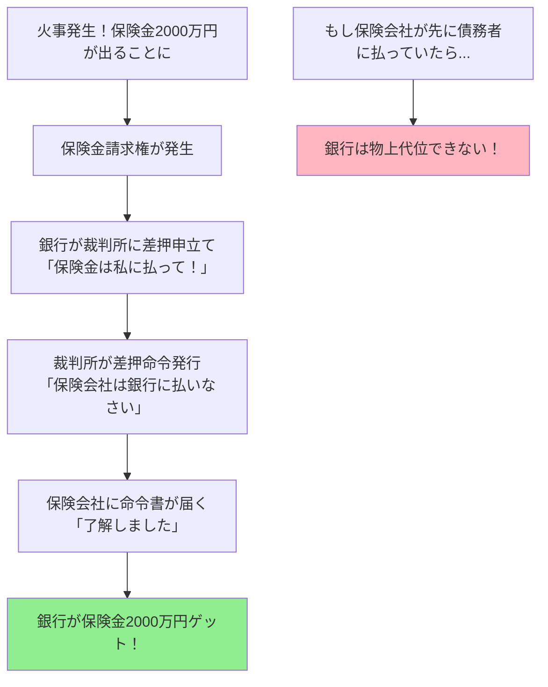

# 物上代位について

---

## スライド1: 物上代位とは

### 🎯 物上代位って結局どういうこと？（かみ砕いた説明）

**わかりやすく言うと：**
銀行がお金を貸す時に「あなたの家を担保にします」と約束したのに、その家が火事で燃えてしまったり、売られてしまったらどうなるでしょう？

普通なら担保がなくなって銀行は困りますよね。でも「物上代位」という仕組みがあれば、
- 🏠 家が燃えた → 🔥 火災保険金を受け取る権利ができる
- 🏠 家を売った → 💰 売却代金を受け取る権利ができる
- 🏠 家を貸した → 🏘️ 家賃を受け取る権利ができる

これらの「新しくできた権利」に対して、銀行は「元の担保と同じように扱わせてもらいます！」と言えるのです。これが物上代位です。

### 具体例で理解する物上代位

**田中さんのケース：**
1. 田中さんは自宅（時価5000万円）を担保に銀行から3000万円借りました
2. 不幸にも火事で家が全焼してしまいました
3. でも火災保険から4000万円おりることに！
4. 銀行は「その保険金から3000万円返してください」と言えます
5. これが物上代位です！

### 定義
- **物上代位（ぶつじょうだいい）**とは、担保目的物が売却・賃貸・滅失等により金銭その他の物に変化した場合に、その変化後の物（代位物）に対しても担保権の効力を及ぼすことができる制度
- 民法304条に規定される抵当権の物上代位が代表例

### 目的
- 担保目的物の変化による担保価値の散逸防止
- 債権者の担保権実行の機会確保
- 担保制度の実効性維持

### 基本的な仕組み
```
担保目的物（不動産）→ 売却 → 売却代金（金銭）
     ↓                        ↓
   抵当権                 抵当権の効力
                        （物上代位）
```

*担保権が目的物の変化に追随して効力を発揮する制度です。*

---

## スライド2: 法的根拠と要件

### 民法304条（抵当権の物上代位）
**条文：**
「抵当権は、その目的物が売却、賃貸、滅失又は損傷によって債務者が受けるべき金銭その他の物に対しても、行使することができる。ただし、その払渡し又は引渡しの前に差押えをしなければならない。」

### 物上代位の成立要件

#### 1. 目的物の変化事由
- **売却**：任意売却・競売による売却
- **賃貸**：目的物を第三者に賃貸すること
- **滅失**：火災・天災等による物理的消滅
- **損傷**：一部破損による価値減少

#### 2. 代位物の発生
- **金銭債権**：売買代金債権、賃料債権、保険金請求権
- **物権**：代替物、修繕による増加部分

#### 3. 差押えの要件
- **時期**：払渡し・引渡し前の差押えが必須
- **対象**：代位物（債権・物）に対する差押え
- **効果**：第三債務者への確定的効力発生

---

## スライド3: 物上代位が認められる範囲

### 抵当権の物上代位（民法304条）

#### 認められる代位物の種類

| 原因 | 代位物 | 具体例（実際のケース） |
|------|--------|--------|
| **売却** | 売買代金債権 | 山田さんが抵当権付きマンション（借金残高2000万円）を3000万円で売却<br>→銀行は買主に「代金は山田さんでなく銀行に払って」と言える |
| **賃貸** | 賃料債権 | 佐藤さんの抵当権付きアパート（借金残高5000万円）の家賃月50万円<br>→銀行は入居者に「家賃は大家でなく銀行に払って」と言える |
| **滅失** | 保険金請求権 | 鈴木さんの抵当権付き自宅（借金残高1500万円）が地震で全壊、保険金2000万円<br>→銀行は保険会社に「保険金は鈴木さんでなく銀行に払って」と言える |
| **損傷** | 損害賠償請求権 | 高橋さんの抵当権付き建物（借金残高800万円）に車が突っ込んで破損、賠償金500万円<br>→銀行は加害者に「賠償金は高橋さんでなく銀行に払って」と言える |

#### 実務上重要な判例法理

**1. 賃料債権への物上代位**
- **判例**：最判平成元年10月27日
- **要件**：建物の賃貸借契約締結後の賃料債権
- **範囲**：将来賃料債権も含む（差押え時点で発生確定したもの）

**2. 転用賃料への物上代位**
- **判例**：最判平成11年11月24日
- **内容**：抵当権設定後の賃貸借から生じる賃料債権
- **条件**：賃貸借契約が抵当権に対抗できない場合

### 先取特権の物上代位

#### 一般先取特権（民法306条）
- **適用条文**：民法304条の準用
- **対象債権**：国税・地方税、雇用関係債権等
- **代位物**：債務者の総財産の変化物

#### 特別先取特権の物上代位

**1. 動産保存の先取特権**
- **代位物**：動産の売却代金、保険金
- **具体例**：保管料債権→保管物売却代金

**2. 不動産保存の先取特権**
- **代位物**：不動産の売却代金、損害賠償金
- **具体例**：建築工事代金債権→建物売却代金

---

## スライド4: 物上代位の制限と限界

### 差押えの要件による制限（かみ砕いた説明）

#### 🔐 なぜ「差押え」が必要なの？

**簡単に言うと：**
物上代位を使うには、お金が債務者の手に渡る前に「ストップ！」をかける必要があります。これが「差押え」です。

**なぜ必要？具体例で説明：**

🏠 **田中さんのマンション売却ケース**
- 田中さんは銀行に2000万円の借金（マンションが担保）
- マンションを3000万円で売却することに
- もし買主が田中さんに直接3000万円払ってしまったら...
  - 田中さんがそのお金を使い込んでしまうかも！
  - 他の借金の返済に使ってしまうかも！
  - 銀行は取り返せなくなる！

**だから銀行は：**
1. 買主がまだ払っていないうちに裁判所に「差押え」を申請
2. 裁判所が買主に「田中さんじゃなくて銀行に払いなさい」と命令
3. これで銀行は確実に2000万円を回収できる！

#### 差押えの必要性（民法304条ただし書）

**目的：**
- **第三債務者の保護** → 買主が二重に払わなくて済むように
- **債権の帰属関係の明確化** → 誰に払えばいいか明確に
- **他の債権者との優先関係の確定** → 早い者勝ちのルール確立

**具体的手続き（実例付き）：**


#### 差押えの時期的限界（具体例で理解）

**✅ 有効な差押え（間に合ったケース）**

🏢 **売買代金のケース**
- 4月1日：契約成立（売買代金5000万円）
- 4月10日：銀行が差押え ← ⭕️ OK！
- 4月15日：決済予定日
- 結果：銀行は5000万円から回収できる

🏘️ **家賃のケース**
- 毎月25日：家賃支払日（50万円）
- 3月20日：銀行が差押え ← ⭕️ OK！
- 3月25日：入居者は銀行に直接支払い
- 結果：毎月の家賃を銀行が受け取れる

🔥 **保険金のケース**
- 1月1日：火災発生
- 1月20日：保険金額確定（3000万円）
- 1月25日：銀行が差押え ← ⭕️ OK！
- 2月1日：保険金支払予定
- 結果：銀行は保険金から回収できる

**❌ 無効な差押え（手遅れケース）**

💸 **既に支払い済みのケース**
- 保険会社「昨日、債務者の口座に振り込みました」
- 銀行「今日差押えします！」← ❌ 手遅れ！
- 理由：もう債務者の財産になってしまった

🏦 **供託されたケース**
- 買主「誰に払えばいいか分からないので法務局に供託しました」
- 銀行「今から差押えます！」← ❌ 手遅れ！
- 理由：供託されると別の手続きが必要

💰 **一般財産に混入したケース**
- 債務者の普通預金口座に売買代金が入金済み
- 他のお金と混ざってしまった
- 銀行「その口座を差押えます！」← ❌ これは物上代位じゃない！
- 理由：もう特定の代位物じゃなくなった

### 抵当権の実行における制限

#### 競売手続きとの関係
- **同時進行**：物上代位権行使と競売手続きの併存可能
- **優先関係**：先に実行した手続きが優先
- **清算関係**：重複部分の調整必要

#### 他の権利者との競合
- **後順位抵当権者**：物上代位の対象から除外
- **一般債権者**：物上代位権者が優先
- **差押債権者**：差押えの先後により決定

---

## スライド5: 具体的事例での理解

### 事例1：建物火災による保険金代位（詳細版）

**🏠 山田太郎さんの実際のケース：**

**背景：**
- 山田さん（45歳、会社員）は3年前に自宅を購入
- 購入価格：1億2000万円（土地4000万円、建物8000万円）
- みずほ銀行から1億円を借入（金利1.2%、35年ローン）
- 火災保険：建物8000万円で加入（東京海上日動）

**🔥 事件の経過：**

**2024年3月15日（金）午後11時**
- 隣家からの延焼により山田邸が全焼
- 山田家族は無事避難

**3月16日（土）**
- 消防署が火災原因を調査開始
- 山田さんが保険会社に連絡

**3月25日（月）**
- 保険会社が損害査定完了
- 保険金額確定：8000万円（建物全損認定）
- 支払予定日：4月10日

**3月28日（木）← ここがポイント！**
- みずほ銀行の担当者が火災を知る
- ローン残高確認：8500万円
- 即座に法務部に連絡、差押え手続き開始

**4月1日（月）**
- 銀行が裁判所に「債権差押命令申立書」提出
- 申立内容：「東京海上日動が山田太郎に支払う予定の火災保険金8000万円を差押える」

**4月3日（水）**
- 裁判所が差押命令発令
- 東京海上日動に差押命令送達
- 山田さんにも通知

**4月5日（金）**
- 東京海上日動から銀行に連絡
- 「差押命令を受領しました。保険金は銀行様にお支払いします」

**4月10日（水）**
- 保険金8000万円が銀行口座に振込
- ローン残高8500万円から8000万円を相殺
- 残債務：500万円

**その後：**
- 山田さんは土地（4000万円相当）を売却
- 売却代金で残債500万円を完済
- 残った3500万円で新しい家の頭金に

**もし差押えが遅れていたら...**
- 4月10日に山田さんの口座に8000万円入金
- 山田さんが生活費や仮住まい費用で使用
- 銀行は一般債権者として請求するしかない
- 全額回収は困難に！

### 事例2：賃貸建物の賃料債権への代位（実例詳細）

**🏢 株式会社タナカ不動産の実際のケース：**

**物件概要：**
- 物件名：タナカビル（東京都渋谷区、築15年）
- 規模：地上8階建て、全40室
- 入居状況：
  - 1階：コンビニ（セブンイレブン）- 月額80万円
  - 2階：歯科医院 - 月額60万円
  - 3階：英会話教室 - 月額50万円
  - 4-8階：オフィス（各階4室）- 各室月額30万円
- 月額賃料総額：310万円
- 抵当権：りそな銀行、債権額2億円

**🚨 経営危機の発生：**

**2024年1月**
- タナカ不動産が別事業（ホテル経営）で大損失
- 資金繰りが急速に悪化
- 銀行への返済が3ヶ月滞納（計1500万円）

**2月15日**
- りそな銀行が対応協議
- 決定：賃料債権への物上代位実行

**📋 差押え手続きの詳細：**

**2月20日 - 準備作業**
- 銀行が全テナントのリスト作成
- 各テナントの契約内容確認
- 賃料支払日の確認（多くは月末）

**2月22日 - 差押申立て**
- 東京地方裁判所に申立書提出
- 対象：全40テナントの3月分以降の賃料債権
- 請求額：月額310万円×将来24ヶ月分

**2月26日 - 差押命令発令**
- 裁判所が差押命令を発令
- 40通の差押命令書を準備

**2月27日-28日 - 送達作業**
- 各テナントに差押命令書を送達
- 送達方法：特別送達（郵便局員が直接手渡し）

**💰 実際の賃料回収状況：**

**3月1日 - セブンイレブンの対応**
- 本社法務部から連絡
- 「差押命令を確認しました。3月分から銀行様に直接振込みます」
- 振込先口座の確認

**3月25日 - 各テナントの振込み**
```
実際の振込み状況：
✅ セブンイレブン：80万円（3/25振込）
✅ 歯科医院：60万円（3/27振込）
✅ 英会話教室：50万円（3/28振込）
✅ オフィステナント：計120万円（3/25-31で順次）
合計：310万円/月を銀行が直接受領
```

**🔧 実務上発生した問題と対応：**

**問題1：テナントの混乱**
- 5階のIT企業「大家に払わないと契約違反では？」
- 銀行の対応：裁判所の命令であることを説明
- 「大家への支払義務は、銀行への支払いで果たされます」

**問題2：敷金の扱い**
- 歯科医院「敷金300万円はどうなる？」
- 回答：敷金は差押え対象外（退去時精算）

**問題3：管理費の処理**
- 管理会社への支払い（月50万円）をどうするか
- 解決：賃料310万円から管理費50万円を控除し、260万円を銀行が受領

**📊 1年後の結果：**
- 回収総額：260万円×12ヶ月＝3,120万円
- ローン残高：2億円→1億6,880万円に減少
- タナカ不動産：その後民事再生法申請
- ビルは競売により売却（落札価格3億円）
- 銀行は残債全額を回収

### 事例3：任意売却による売買代金代位

**状況設定：**
- A所有の土地（時価5000万円）にB銀行が6000万円の抵当権
- Aが任意売却で4500万円で売却契約成立
- 売買代金支払い前にB銀行が物上代位権行使

**代位権行使の手続き：**
1. **差押申立て**：売買代金債権に対する差押命令申立て
2. **命令送達**：買主（第三債務者）への差押命令送達
3. **取立て**：B銀行が買主から直接4500万円回収
4. **清算**：残債権1500万円はAの他財産から回収

---

## スライド6: 他の制度との比較

### 詐害行為取消権との相違

| 項目 | 物上代位 | 詐害行為取消権 |
|------|----------|----------------|
| **性質** | 担保権の効力拡張 | 責任財産の保全 |
| **要件** | 差押えのみ | 詐害意思・受益者悪意等 |
| **効果** | 代位物への担保権行使 | 行為の取消し |
| **対象** | 担保権者のみ | 一般債権者 |

### 債権者代位権との相違

| 項目 | 物上代位 | 債権者代位権 |
|------|----------|--------------|
| **行使主体** | 担保権者 | 一般債権者 |
| **被保全債権** | 担保権付債権 | 一般債権 |
| **要件** | 差押え | 債務者の無資力等 |
| **効果** | 優先弁済 | 債務者への帰属 |

### 相殺との関係

**物上代位権と相殺の競合問題：**
- **判例法理**：最判平成10年1月30日
- **結論**：相殺の意思表示と差押えの先後により決定
- **理由**：両者とも法律で認められた権利行使

**具体的判定基準：**
1. **差押え先行**：物上代位権が優先
2. **相殺意思表示先行**：相殺が優先
3. **同時**：相殺が優先（債務者保護の観点）

---

## スライド7: 実務上の注意点と限界

### 実務上の課題

#### 1. 差押えのタイミング（実際の失敗例と成功例）

**😱 実際の失敗例：A信用金庫のケース**

**状況：**
- 債務者：佐藤建設（株）、借入金5000万円
- 担保：本社ビル（渋谷区、時価8000万円）
- 2023年12月：佐藤建設が本社ビル売却を決定

**失敗の経緯：**
```
12月1日（金）：売買契約締結（売却価格7000万円）
12月4日（月）：A信金の担当者が売却を知る
12月5日（火）：上司に報告、会議を開催
12月6日（水）：本部決裁を待つ
12月7日（木）：弁護士に相談
12月8日（金）：差押申立書作成
12月11日（月）：裁判所に申立て
12月12日（火）午前：買主が代金7000万円を振込 ← 手遅れ！
12月12日（火）午後：差押命令発令... でも既に遅い
```

**結果：**
- 物上代位不可能に
- 一般債権者として請求するも、佐藤建設は翌月倒産
- 回収額：配当でわずか500万円（回収率10%）

**😊 成功例：B地方銀行のケース**

**状況：**
- 債務者：田中工業（株）、借入金8000万円
- 担保：工場（埼玉県、時価1億円）
- 2024年1月：工場で火災発生

**成功の経緯：**
```
1月15日（月）23時：火災発生
1月16日（火）9時：B銀行の担当者がニュースで覚知
1月16日（火）10時：緊急対策チーム結成
1月16日（火）11時：保険会社に照会（保険金9000万円判明）
1月16日（火）14時：弁護士が申立書作成完了
1月16日（火）16時：裁判所に緊急申立て
1月17日（水）：差押命令発令
1月18日（木）：保険会社に送達完了 ← 間に合った！
2月20日：保険金9000万円を銀行が受領
```

**成功のポイント：**
1. **事前準備**：差押申立書のひな型を用意
2. **情報網**：取引先の動向を日々チェック
3. **即断即決**：現場に権限委譲
4. **専門家連携**：顧問弁護士とホットライン

**🔍 実務の現場から - 銀行員の声：**

> 「正直、差押えは時間との勝負です。特に最近は電子送金が当たり前なので、売買代金なんて契約から3日で振り込まれることもある。だから私たちは：
> 
> - 担保物件の登記を毎月チェック
> - 債務者の決算書に売却予定の記載がないか確認
> - 近隣の不動産業者と情報交換
> - 火災や事故のニュースは即座にチェック
> 
> これくらいやって、やっと間に合うかどうかです」
> 
> （都市銀行融資担当、40代）

#### 2. 代位物の範囲確定
**課題：**
- 賃料債権の将来分の範囲
- 保険金からの必要費控除
- 売買代金からの諸費用控除

**対策：**
- 契約書等での代位物範囲の事前確認
- 法律専門家との連携による適切な範囲設定
- 清算手続きの透明性確保

#### 3. 他の権利者との調整
**課題：**
- 複数抵当権者間の配当調整
- 税金・公租公課の優先権との関係
- 一般債権者による異議申立て

**対策：**
- 権利関係の事前調査徹底
- 配当手続きの適正実施
- 関係者間の協議による円満解決

### 制度の限界（具体例で理解する）

#### 経済的限界 - 実際の数字で見る

**💸 ケース1：費用倒れになった事例**

中村さんの自宅ローン（地方都市）：
- ローン残高：500万円
- 担保物件：築30年の一戸建て
- 火災発生→保険金：200万円

差押え費用の内訳：
```
弁護士費用：30万円
申立手数料：2万円
予納郵券代：5,000円
登記簿取得：2,000円
送達費用：3,000円
-------------------
合計：約33万円

回収額200万円 - 費用33万円 = 実質回収167万円
費用率：16.5%！
```

銀行の判断：「費用対効果を考えると...でも債権保全のためには必要」

**📉 ケース2：代位物価値の限界**

高級マンションの悲劇：
- 購入時：1億5000万円（バブル期）
- ローン残高：8000万円
- 現在の時価：6000万円
- 売却額：5500万円（早期売却のため安値）

結果：
- 物上代位で回収：5500万円
- 不足額：2500万円
- この差額は一般債権として請求するしかない

#### 法的限界 - トラブル事例集

**🔄 ケース1：相殺との競合で負けた事例**

状況：
- 山田商事がA銀行に3000万円の借金（建物に抵当権）
- 山田商事が建物を売却（代金4000万円）
- 買主のB社は山田商事に売掛金2000万円があった

タイムライン：
```
3月1日：売買契約成立
3月5日：B社「売掛金と相殺します」と通知
3月6日：A銀行が差押申立て ← 1日遅かった！

結果：
- B社の相殺が有効（2000万円分）
- A銀行は残り2000万円しか回収できず
```

**⚖️ ケース2：第三債務者が板挟みになった事例**

保険会社の苦悩：
- 契約者：田中さん（火災保険金1000万円）
- 抵当権者：X銀行とY信金（両方が差押え）
- 保険会社：「どっちに払えばいいの！？」

結果：
- 保険会社は供託を選択（法務局に1000万円を預ける）
- X銀行とY信金で配当を巡って裁判に
- 解決まで1年以上かかった

**⏰ ケース3：時効で消滅した事例**

長期化した賃料債権：
- 2019年：オフィスビルに抵当権設定
- 2020年：賃料債権を差押え
- 2021年：債務者が行方不明に
- 2024年：古い賃料債権が時効消滅（3年）
- 結果：3年分の賃料が回収不能に

#### 実務担当者の本音

**銀行法務部のベテラン談：**
> 「物上代位は『あると助かる』制度だけど『これだけに頼れない』制度でもある。なぜなら：
>
> 1. タイミングがシビアすぎる（1日の遅れが命取り）
> 2. 費用が意外とかかる（少額債権だと赤字になることも）
> 3. 第三債務者とのトラブルリスク（関係悪化を恐れて躊躇することも）
> 4. 完全な回収は難しい（担保価値 > 債権額とは限らない）
>
> だから我々は物上代位を『プランB』として準備しつつ、メインは通常の債権回収や任意売却での回収を目指します」

---

## まとめ

物上代位は担保権の実効性を確保する重要な制度です。

**覚えるポイント：**
- 物上代位 = 担保目的物の変化に追随する担保権の効力
- 民法304条 = 抵当権の物上代位の基本規定
- 差押え要件 = 払渡し・引渡し前の差押えが必須
- 認められる範囲 = 売却・賃貸・滅失・損傷による代位物

**実務での重要性：**
- 不動産担保融資における追加回収手段
- 賃貸不動産の収益確保方法
- 保険事故時の担保価値保全手段

---

## 用語説明

### 基本的な担保法用語

**担保権（たんぽけん）**
- 債権の弁済を確保するために、特定の財産から優先的に弁済を受けることができる権利
- 例：抵当権、質権、先取特権、留置権

**担保目的物（たんぽもくてきぶつ）**
- 担保権の対象となる財産
- 例：抵当権の場合の土地・建物、質権の場合の動産・債権

**物上代位権（ぶつじょうだいいけん）**
- 担保目的物が他の物に変化した場合に、その変化後の物に対して担保権を行使できる権利
- 担保権の効力の拡張として位置づけられる

**代位物（だいいぶつ）**
- 担保目的物が変化した後の物
- 例：売却代金、賃料、保険金、損害賠償金

### 差押えに関する用語

**差押え（さしおさえ）**
- 債務者が財産を処分することを禁止し、強制執行の準備として財産を確保する手続き
- 物上代位では第三債務者への確定的効力発生が目的

**第三債務者（だいさんさいむしゃ）**
- 債務者に対して債務を負っている者
- 物上代位では代位物の給付義務者（買主、賃借人、保険会社等）

**払渡し・引渡し（はらいわたし・ひきわたし）**
- 第三債務者が債務者に対して金銭の支払いや物の引渡しを行うこと
- この前に差押えが必要（民法304条ただし書）

### 抵当権関連用語

**抵当権（ていとうけん）**
- 債務の担保として提供された不動産について、債務が弁済されない場合に、その不動産から優先的に弁済を受けることができる権利
- 占有を移転せずに設定可能な担保権

**抵当権者（ていとうけんしゃ）**
- 抵当権を有する者（通常は債権者）
- 物上代位権の行使主体

**抵当権設定者（ていとうけんせっていしゃ）**
- 抵当権を設定した者（通常は債務者または物上保証人）
- その所有する不動産に抵当権が設定される

**根抵当権（ねていとうけん）**
- 一定の範囲に属する不特定の債権を担保するために設定される抵当権
- 物上代位についても民法398条の20で準用規定

### 優先権に関する用語

**先取特権（さきどりとっけん）**
- 法律の規定により、特定の債権者が他の債権者に先立って弁済を受けることができる権利
- 一般先取特権と特別先取特権に分類

**優先弁済権（ゆうせんべんさいけん）**
- 複数の債権者がいる場合に、特定の債権者が他の債権者より先に弁済を受けることができる権利
- 担保権の本質的効力

**物上保証（ぶつじょうほしょう）**
- 他人の債務の担保として自己の財産に担保権を設定すること
- 物上保証人も物上代位の利益を享受

**競売（けいばい）**
- 裁判所が担保権の実行として担保目的物を強制的に売却する手続き
- 物上代位権行使と競売手続きは併存可能