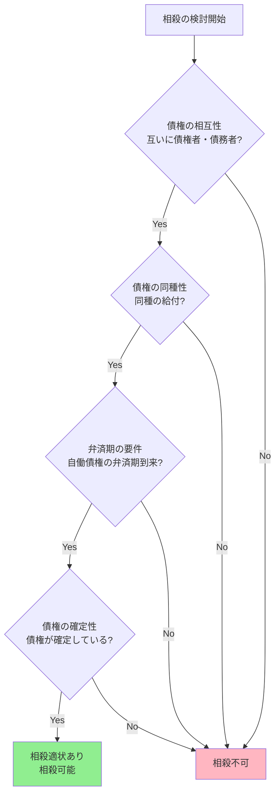

# 相殺について

---

## スライド1: 相殺とは

### 定義
- **相殺（そうさい）**とは、互いに同種の債務を負担する当事者が、一方の債権と他方の債権を対等額で消滅させる制度
- 民法505条に規定

### 目的
- 決済の簡便化
- 取引の安全と効率化
- 債権回収の確実性向上

### 具体例での理解
```
例：AとBの取引関係
A → B：100万円の貸金債権
B → A：80万円の売掛金債権

相殺後：
A → B：20万円の貸金債権（残額）
B → A：0円（消滅）
```

*注：画像生成機能は利用できませんが、上記の図表で相殺の概念を視覚的に理解できます。*

---

## スライド2: 自働債権

### 定義
- **自働債権（じどうさいけん）**：相殺を主張する者が有する債権
- 相殺の意思表示をする側の債権

### 特徴と詳細説明

#### 1. 相殺適状にあることが必要
- **意味**：相殺の要件をすべて満たした状態
- **具体例**：金銭債権で、債権が確定しており、弁済期が到来している状態

#### 2. 弁済期が到来していることが原則
- **意味**：債権の履行を請求できる時期が来ていること
- **具体例**：
  - ○ 2024年12月31日期限の貸金が、2025年1月1日に相殺主張→弁済期経過済み
  - × 2025年12月31日期限の貸金を、2025年6月1日に相殺主張→弁済期未到来

#### 3. 債権者が積極的に行使する債権
- **意味**：相殺の意思表示によって相手方債権を消滅させる攻撃的な役割
- **具体例**：貸主Aが借主Bからの売掛金請求に対し、「私の貸金債権と相殺する」と主張

### 実務での典型例
1. **貸金債権**：銀行が顧客の預金債務と貸付債権を相殺
2. **売掛金債権**：取引先同士の売掛金・買掛金の相殺
3. **損害賠償債権**：契約違反による損害賠償請求権での相殺

---

## スライド3: 受働債権

### 定義
- **受働債権（じゅどうさいけん）**：相殺される側の債権
- 相殺の意思表示を受ける側の債権

### 特徴と詳細説明

#### 1. 弁済期の到来は不要（判例）
- **法的根拠**：最高裁判例により確立
- **理由**：相殺は債務者保護の制度でもあるため
- **具体例**：
  - A → B：100万円の貸金債権（弁済期：2025年1月1日）
  - B → A：80万円の売掛金債権（弁済期：2025年6月1日）
  - 2025年2月1日にAが相殺主張→Bの売掛金債権は弁済期未到来でも相殺可能

#### 2. 自働債権と同種の給付を目的とする
- **意味**：同じ種類の債権でなければ相殺できない
- **具体例**：
  - ○ 金銭債権同士の相殺
  - × 金銭債権と物の引渡し債権の相殺

#### 3. 相殺によって消滅する債権
- **意味**：受動的に消滅させられる立場
- **効果**：対等額の範囲で自動的に消滅

### 実務での注意点
1. **債権の特定**：どの債権が受働債権となるかの明確化が重要
2. **金額の確定**：争いのない確定した金額での相殺が原則
3. **時効の中断**：相殺により時効進行が停止する効果

---

## スライド4: 相殺適状

### 定義
- **相殺適状（そうさいてきじょう）**：相殺が可能な状態・条件
- すべての要件を満たした時点で相殺の意思表示が可能となる

### 相殺可能・不可能の判定表

| 要件 | 可能な場合 | 不可能な場合 |
|------|------------|--------------|
| **債権の相互性** | 当事者が互いに債権者・債務者 | 一方的な債権・債務関係 |
| **債権の同種性** | 金銭債権同士、同一通貨 | 金銭債権と物品引渡債権 |
| **弁済期の到来** | 自働債権の弁済期が到来 | 自働債権の弁済期が未到来 |
| **債権の確定性** | 債権額・内容が確定 | 債権額・存在に争いがある |

### 相殺適状の判定フローチャート



### 具体的な相殺可否事例

#### ✅ 相殺可能なケース
1. **通常の商取引**
   - A社 → B社：売掛金500万円（弁済期経過）
   - B社 → A社：買掛金300万円
   - 結果：300万円ずつ相殺、A社に200万円の債権残存

2. **銀行取引**
   - 顧客 → 銀行：普通預金1000万円
   - 銀行 → 顧客：貸付金800万円（弁済期経過）
   - 結果：800万円ずつ相殺、顧客に200万円の預金残存

#### ❌ 相殺不可能なケース
1. **債権の同種性なし**
   - A → B：金銭債権100万円
   - B → A：商品引渡し債権（価値100万円相当）
   - 理由：給付の種類が異なる

2. **弁済期未到来**
   - A → B：貸金100万円（弁済期：来年まで未到来）
   - B → A：売掛金80万円
   - 理由：自働債権の弁済期が未到来

---

## スライド5: 相殺の効果

### 対等額消滅
- 自働債権と受働債権が対等額で消滅
- 残額があれば存続

### 遡及効
- 相殺適状が生じた時点に遡って消滅（民法506条2項）

### 例での計算
- 自働債権：100万円
- 受働債権：80万円
- 結果：80万円ずつ消滅、Aは20万円の債権を保持

---

## スライド6: 相殺の制限

### 相殺禁止債権（民法509条）

#### 1. 不法行為による損害賠償債権
**具体的状況例：**
- **交通事故のケース**
  - A：Bに対する交通事故損害賠償請求権500万円
  - B：Aに対する売掛金債権300万円
  - 結果：Bは売掛金債権による相殺はできない
  - 理由：被害者の損害填補を確実にするため

#### 2. 人の生命・身体の侵害による損害賠償債権
**具体的状況例：**
- **労災事故のケース**
  - 従業員：会社に対する労災損害賠償請求権1000万円
  - 会社：従業員に対する貸付金債権200万円
  - 結果：会社は貸付金債権による相殺はできない
  - 理由：生命・身体の損害は人格権保護の観点から特別扱い

### その他の制限

#### 差押えを受けた債権（民法511条）
**具体的状況例：**
- **債権差押えのケース**
  - A：Bに対する売掛金債権300万円（裁判所が差押え）
  - B：Aに対する買掛金債権200万円
  - 状況：差押え後にBが相殺を主張
  - 結果：差押え後に取得した債権での相殺は制限される

#### 支払停止後に取得した債権（破産法等）
**具体的状況例：**
- **破産手続きのケース**
  - A：B会社に対する売掛金債権500万円
  - B会社：支払停止を公告（2024年6月1日）
  - A：その後B会社から商品を購入し買掛金債権100万円取得（2024年7月1日）
  - 結果：Aは支払停止後取得の買掛金債権では相殺できない

### 合意による相殺排除
**具体的状況例：**
- **契約書での相殺禁止特約**
  - 金銭消費貸借契約に「借主は一切の債権による相殺をすることができない」と記載
  - 効果：当事者間で有効な合意として機能
  - 注意：公序良俗に反しない範囲で有効

---

## まとめ

相殺制度は取引の簡便化と安全性を図る重要な制度です。

**覚えるポイント：**
- 相殺 = 互いの債権を対等額で消滅させる制度
- 自働債権 = 相殺を主張する側の債権（弁済期要）
- 受働債権 = 相殺される側の債権（弁済期不要）
- 相殺適状 = 相殺可能な4つの要件を満たした状態

---

## 用語説明

### 基本的な法律用語

**債権（さいけん）**
- 特定の人（債権者）が他の特定の人（債務者）に対して、一定の行為（給付）を請求することができる権利
- 例：お金を貸した人が、借りた人に返済を求める権利

**債務（さいむ）**
- 特定の人（債務者）が他の特定の人（債権者）に対して、一定の行為（給付）をしなければならない義務
- 例：お金を借りた人が、貸した人に返済しなければならない義務

**債権者（さいけんしゃ）**
- 債権を有する人。給付を請求できる立場の人
- 例：お金を貸した人、商品を売った人

**債務者（さいむしゃ）**
- 債務を負う人。給付をしなければならない立場の人  
- 例：お金を借りた人、商品を買った人

**給付（きゅうふ）**
- 債務者が債権者に対して行うべき行為
- 例：金銭の支払い、物の引渡し、サービスの提供

### 弁済期（べんさいき）について

**弁済期とは**
- 債務者が債務の履行（弁済）をすべき時期
- この時期が到来すると、債権者は履行を請求でき、債務者は履行の義務を負う

**弁済期の種類**
1. **確定期限**：具体的な日時が定められている場合
   - 例：「2024年12月31日まで」
2. **不確定期限**：到来することは確実だが、いつかは不明な場合
   - 例：「Aが亡くなったとき」
3. **期限の定めなし**：特に期限を定めていない場合
   - 債権者はいつでも履行を請求可能

**相殺における弁済期の重要性**
- **自働債権**：弁済期の到来が必要（相殺を主張できる前提条件）
- **受働債権**：弁済期の到来は不要（判例により確立）

**期限の利益**
- 債務者が期限まで弁済を猶予される利益
- 期限前に弁済を強制されない権利
- 相殺の場面では、自働債権についてのみこの概念が重要