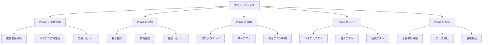
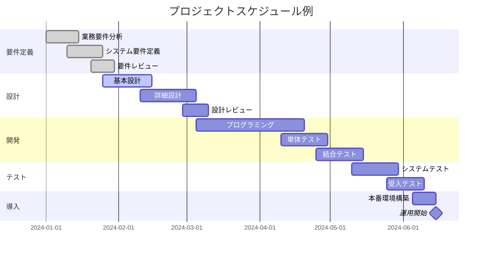
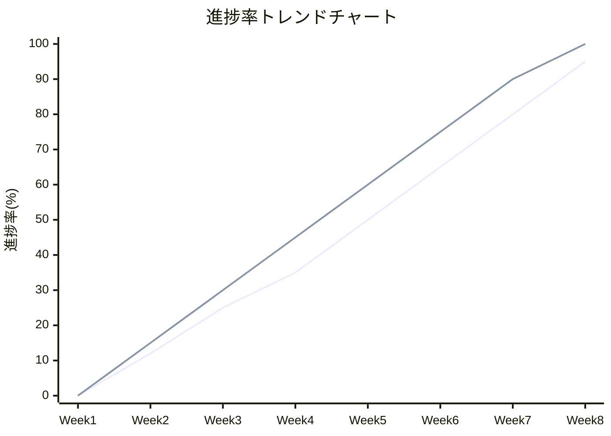
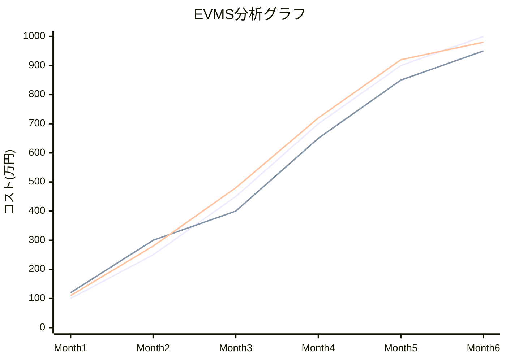

# プロジェクト進捗管理について

## 目次
1. [概要](#概要)
2. [WBS（Work Breakdown Structure）](#wbswork-breakdown-structure)
3. [ガントチャート](#ガントチャート)
4. [トレンドチャート](#トレンドチャート)
5. [EVMS（Earned Value Management System）](#evmsearned-value-management-system)
6. [各手法の比較と適用場面](#各手法の比較と適用場面)
7. [実践的な活用方法](#実践的な活用方法)
8. [クイズセクション](#クイズセクション)

## 概要

プロジェクト進捗管理は、プロジェクトの計画立案から完了まで、効率的かつ効果的にプロジェクトを推進するための重要な管理活動です。適切な進捗管理により、プロジェクトの成功確率を大幅に向上させることができます。

本ドキュメントでは、プロジェクト進捗管理の4つの主要な手法について詳しく解説します：

- **WBS（Work Breakdown Structure）**：作業分解構成図
- **ガントチャート**：時間軸と作業を可視化するチャート
- **トレンドチャート**：進捗状況の傾向を分析するグラフ
- **EVMS（Earned Value Management System）**：出来高管理システム

これらの手法を組み合わせることで、包括的で効果的なプロジェクト管理が実現できます。

## WBS（Work Breakdown Structure）

### 定義と目的

WBS（Work Breakdown Structure：作業分解構成図）は、プロジェクトの全体的な作業範囲を階層的に分解し、管理可能な小さな作業単位（ワークパッケージ）に細分化する構造化された手法です。

**主な目的：**
- プロジェクトスコープの明確化
- 作業の漏れや重複の防止
- 責任範囲の明確化
- 工数見積もりの精度向上
- 進捗管理の基盤作成

### WBSの構造



### WBS作成の原則

**100%ルール**
- 上位レベルの作業は、下位レベルの作業の合計と100%一致する必要がある
- 漏れや重複があってはならない

**階層の深さ**
- 一般的に3〜6階層程度が適切
- あまり深くしすぎると管理が複雑になる

**ワークパッケージの粒度**
- 最下位レベルは1〜2週間程度の作業量
- 責任者が明確に割り当てられる単位

### WBSの種類

| 種類 | 特徴 | 適用場面 | メリット | デメリット |
|------|------|----------|----------|------------|
| **成果物ベースWBS** | 成果物を基準に分解 | 製品開発、建設プロジェクト | 成果物が明確、品質管理しやすい | プロセスが見えにくい |
| **フェーズベースWBS** | プロジェクトフェーズを基準に分解 | システム開発、研究開発 | プロセスが明確、進捗管理しやすい | 成果物の関連性が見えにくい |
| **組織ベースWBS** | 組織構造を基準に分解 | 大規模プロジェクト | 責任範囲が明確 | 作業の関連性が見えにくい |

## ガントチャート

### 定義と特徴

ガントチャートは、プロジェクトのスケジュールを横棒グラフで表現する進捗管理ツールです。時間軸に対して各作業の開始日、終了日、期間、進捗状況を視覚的に表示します。

**主な特徴：**
- 時間軸による作業の可視化
- 作業間の依存関係の表現
- リソースの割り当て表示
- 進捗状況の一目での把握

### ガントチャートの構成要素



### ガントチャートの活用方法

**スケジュール管理**
- プロジェクト全体の期間把握
- 各作業の開始・終了タイミング管理
- クリティカルパスの特定

**リソース管理**
- 人員配置の最適化
- 作業負荷の平準化
- スキル要件の事前確認

**コミュニケーション**
- ステークホルダーへの進捗報告
- チーム内での情報共有
- 問題の早期発見と対応

### ガントチャートの限界と対策

**限界：**
- 複雑な依存関係の表現が困難
- 頻繁な変更に対する更新コストが高い
- 不確実性の高い作業の表現が困難

**対策：**
- ネットワーク図との併用
- 定期的な更新とレビューの実施
- バッファ時間の組み込み

## トレンドチャート

### 定義と目的

トレンドチャートは、プロジェクトの進捗状況を時系列で表示し、計画と実績の差異や将来の傾向を分析するためのグラフです。プロジェクトの健全性を継続的に監視し、早期警告システムとして機能します。

**主な目的：**
- 進捗の傾向分析
- 問題の早期発見
- 将来予測の精度向上
- 意思決定支援

### トレンドチャートの種類

**1. 進捗率トレンドチャート**



**2. 工数消費トレンドチャート**

**3. 課題・リスク発生トレンドチャート**

**4. 品質指標トレンドチャート**

### トレンドチャートの作成方法

**データ収集**
- 定期的な進捗データの収集（週次または月次）
- 一貫した測定基準の適用
- 客観的で定量的な指標の使用

**分析観点**
- 計画との乖離度
- 傾向の変化点
- 季節性やパターンの識別
- 異常値の検出

**活用方法**
- 定期的なプロジェクトレビューでの使用
- ステークホルダーへの報告
- プロジェクト改善のための根拠データ

## EVMS（Earned Value Management System）

### 定義と概念

EVMS（Earned Value Management System：出来高管理システム）は、プロジェクトのコスト、スケジュール、スコープを統合的に管理する手法です。計画価値（PV）、実績コスト（AC）、出来高（EV）の3つの基本指標を用いて、プロジェクトのパフォーマンスを定量的に評価します。

### EVMSの基本指標

**1. 計画価値（PV：Planned Value）**
- ある時点までに計画されていた作業の予算価値
- 別名：BCWS（Budgeted Cost of Work Scheduled）

**2. 出来高（EV：Earned Value）**
- ある時点までに実際に完了した作業の予算価値
- 別名：BCWP（Budgeted Cost of Work Performed）

**3. 実績コスト（AC：Actual Cost）**
- ある時点までに実際に消費したコスト
- 別名：ACWP（Actual Cost of Work Performed）

### EVMSの派生指標

**コスト差異（CV：Cost Variance）**
```
CV = EV - AC
```
- 正の値：予算内で作業が進行
- 負の値：予算超過

**スケジュール差異（SV：Schedule Variance）**
```
SV = EV - PV
```
- 正の値：スケジュールより先行
- 負の値：スケジュール遅れ

**コスト効率指数（CPI：Cost Performance Index）**
```
CPI = EV / AC
```
- 1.0以上：コスト効率が良好
- 1.0未満：コスト効率が悪化

**スケジュール効率指数（SPI：Schedule Performance Index）**
```
SPI = EV / PV
```
- 1.0以上：スケジュール効率が良好
- 1.0未満：スケジュール効率が悪化

### EVMSの実践例



**グラフの読み方：**
- 青線：計画価値（PV）
- 赤線：実績コスト（AC）
- 緑線：出来高（EV）

**分析結果：**
- Month 4時点でのCPI = 650/720 = 0.90（コスト効率悪化）
- Month 4時点でのSPI = 650/700 = 0.93（スケジュール遅れ）

### EVMSによる将来予測

**完成時総コスト（EAC：Estimate at Completion）**

**現在の効率が継続する場合：**
```
EAC = BAC / CPI
```

**今後の作業が計画通り進む場合：**
```
EAC = AC + (BAC - EV)
```

**完成時差異（VAC：Variance at Completion）**
```
VAC = BAC - EAC
```

## 各手法の比較と適用場面

### 特徴比較表

| 手法 | 主な目的 | 適用フェーズ | 更新頻度 | 習得難易度 | 効果性 |
|------|----------|--------------|----------|------------|---------|
| **WBS** | 作業分解・構造化 | 計画段階 | 変更時 | 低 | 高 |
| **ガントチャート** | スケジュール管理 | 計画〜実行段階 | 週次〜月次 | 低 | 中 |
| **トレンドチャート** | 傾向分析 | 実行〜監視段階 | 週次〜月次 | 中 | 中 |
| **EVMS** | 統合的パフォーマンス管理 | 実行〜監視段階 | 週次〜月次 | 高 | 高 |

### プロジェクト規模別適用指針

**小規模プロジェクト（～50人日）**
- WBS：簡易版（2-3階層）
- ガントチャート：Excel等での簡易管理
- トレンドチャート：進捗率のみ
- EVMS：適用しない（オーバーヘッドが大きい）

**中規模プロジェクト（50～500人日）**
- WBS：標準版（3-4階層）
- ガントチャート：専用ツールでの管理
- トレンドチャート：複数指標での分析
- EVMS：簡易版の適用

**大規模プロジェクト（500人日以上）**
- WBS：詳細版（4-6階層）
- ガントチャート：リソース管理機能付き
- トレンドチャート：多角的分析
- EVMS：本格運用

## 実践的な活用方法

### 統合的なアプローチ

効果的なプロジェクト管理には、4つの手法を組み合わせた統合的なアプローチが重要です：

**1. 計画段階**
- WBSでプロジェクトを構造化
- ガントチャートでスケジュール作成
- EVMSの基準値設定

**2. 実行段階**
- ガントチャートでの日常管理
- トレンドチャートでの定期分析
- EVMSでのパフォーマンス評価

**3. 監視・制御段階**
- 全手法からの情報統合
- 意思決定のための分析
- 改善アクションの実施

### 成功要因

**組織的要因**
- 経営層のコミットメント
- プロジェクトマネジメント文化の醸成
- 適切なツールとインフラの整備

**技術的要因**
- 標準化されたプロセスの確立
- データの品質と一貫性の確保
- 継続的な改善活動

**人的要因**
- プロジェクトマネージャーのスキル向上
- チームメンバーの理解と協力
- ステークホルダーとの効果的なコミュニケーション

---

# クイズセクション

## 問題編

### 問題1：WBSの基本原則
WBSを作成する際の「100%ルール」とは何を意味しているでしょうか？

選択肢：
1. 全ての作業を100%完了させる必要がある
2. 上位レベルの作業は、下位レベルの作業の合計と100%一致する必要がある
3. プロジェクトの成功確率を100%にする必要がある
4. 100%の精度でスケジュールを作成する必要がある
5. チーム全員が100%の能力を発揮する必要がある

---

### 問題2：ガントチャートの特徴
ガントチャートの主な特徴として最も適切でないものはどれでしょうか？

選択肢：
1. 時間軸による作業の可視化
2. 作業間の依存関係の表現
3. コストと進捗の統合分析
4. 進捗状況の一目での把握
5. リソースの割り当て表示

---

### 問題3：トレンドチャートの目的
トレンドチャートの主な目的として最も適切なものはどれでしょうか？

選択肢：
1. 作業の詳細な分解
2. スケジュールの作成
3. 進捗の傾向分析と早期警告
4. コストの詳細計算
5. 組織構造の可視化

---

### 問題4：EVMSの基本指標
EVMSの3つの基本指標として正しい組み合わせはどれでしょうか？

選択肢：
1. PV、AC、CV
2. EV、SV、CPI
3. PV、EV、AC
4. CV、SV、SPI
5. BAC、EAC、VAC

---

### 問題5：CPI（コスト効率指数）の計算
あるプロジェクトで、出来高（EV）が800万円、実績コスト（AC）が1000万円の場合、CPI（コスト効率指数）はいくつでしょうか？

選択肢：
1. 0.6
2. 0.8
3. 1.0
4. 1.2
5. 1.25

---

### 問題6：スケジュール差異（SV）の解釈
SV = EV - PV = -50万円の場合、プロジェクトの状況をどう解釈すべきでしょうか？

選択肢：
1. スケジュールより50万円分先行している
2. スケジュールより50万円分遅れている
3. コストが50万円超過している
4. コストが50万円節約できている
5. 判断できない

---

### 問題7：プロジェクト規模と手法の適用
500人日規模のプロジェクトに最も適したEVMSの適用レベルはどれでしょうか？

選択肢：
1. 適用しない
2. 簡易版の適用
3. 本格運用
4. 部分的な適用のみ
5. 外部委託での適用

---

### 問題8：統合的アプローチ
プロジェクト管理における4つの手法を統合的に活用する際、計画段階で最も重要なのはどれでしょうか？

選択肢：
1. トレンドチャートでの傾向分析
2. EVMSでのパフォーマンス評価
3. WBSでのプロジェクト構造化
4. ガントチャートでの日常管理
5. 全て同等に重要

---

### 問題9：ワークパッケージの適切な粒度
WBSの最下位レベル（ワークパッケージ）の適切な作業量はどの程度でしょうか？

選択肢：
1. 1日程度
2. 1〜2週間程度
3. 1ヶ月程度
4. 2〜3ヶ月程度
5. 決まった基準はない

---

### 問題10：複合問題
あるプロジェクトで以下の状況の場合、最も適切な対応はどれでしょうか？

**状況：**
- CPI = 0.85（コスト効率悪化）
- SPI = 1.1（スケジュール先行）
- トレンドチャートでコスト超過傾向が継続

選択肢：
1. スケジュールが順調なので問題ない
2. コスト管理の見直しと改善策の実施
3. スケジュールを遅らせてコストを調整
4. プロジェクトの中止を検討
5. 現状維持で様子を見る

---

## 解説編

### 問題1の解説
**正解：2. 上位レベルの作業は、下位レベルの作業の合計と100%一致する必要がある**

**詳細解説：**
100%ルールは、WBS作成における最も重要な原則の一つです。このルールは以下を意味します：

**100%ルールの内容：**
- 親要素の作業範囲は、子要素の作業範囲の合計と完全に一致する
- 漏れがあってはならない（100%未満になってはいけない）
- 重複があってはならない（100%を超えてはいけない）

**具体例：**
「システム開発」が親要素の場合：
- 子要素：「要件定義」「設計」「開発」「テスト」「導入」
- これらの合計が「システム開発」の全範囲と一致する必要がある

**重要性：**
- スコープの明確化
- 作業の漏れや重複の防止
- 工数見積もりの精度向上
- プロジェクト管理の基盤作成

---

### 問題2の解説
**正解：3. コストと進捗の統合分析**

**詳細解説：**
ガントチャートは主にスケジュール管理を目的としたツールであり、コストと進捗の統合分析はEVMSの機能です。

**ガントチャートの主な特徴：**
1. **時間軸による作業の可視化** ✓
   - 横軸に時間、縦軸に作業項目を配置
   - 各作業の期間を横棒で表現

2. **作業間の依存関係の表現** ✓
   - 矢印や線で依存関係を表示
   - クリティカルパスの特定が可能

3. **進捗状況の一目での把握** ✓
   - 色分けや進捗バーで視覚的に表現
   - 遅れや先行が一目瞭然

4. **リソースの割り当て表示** ✓
   - 各作業に担当者やリソースを割り当て表示
   - 負荷の分散状況を確認可能

**コストと進捗の統合分析：**
- これはEVMSの機能
- PV、EV、ACの3つの指標を統合
- CPI、SPIなどの効率指数で分析

---

### 問題3の解説
**正解：3. 進捗の傾向分析と早期警告**

**詳細解説：**
トレンドチャートは、プロジェクトの各種指標を時系列で表示し、傾向を分析することで問題を早期発見するツールです。

**トレンドチャートの主な目的：**

1. **進捗の傾向分析**
   - 計画と実績の推移を時系列で比較
   - 将来の傾向を予測
   - パターンや季節性の識別

2. **早期警告システム**
   - 異常値の検出
   - 悪化傾向の早期発見
   - 予防的な対策の実施

3. **意思決定支援**
   - 客観的なデータに基づく判断
   - 根拠のある改善策の立案
   - ステークホルダーへの説明資料

**活用例：**
- 進捗率の推移
- コスト消費状況
- 品質指標の変化
- リスク・課題の発生状況

**他の選択肢：**
- 作業の詳細な分解：WBSの機能
- スケジュールの作成：ガントチャートの機能
- コストの詳細計算：EVMSの機能
- 組織構造の可視化：組織図の機能

---

### 問題4の解説
**正解：3. PV、EV、AC**

**詳細解説：**
EVMSは3つの基本指標から構成され、これらから各種分析指標が導出されます。

**3つの基本指標：**

1. **PV（Planned Value：計画価値）**
   - ある時点までに計画されていた作業の予算価値
   - 別名：BCWS（Budgeted Cost of Work Scheduled）
   - 「計画では今までにどれだけの価値の作業をする予定だったか」

2. **EV（Earned Value：出来高）**
   - ある時点までに実際に完了した作業の予算価値
   - 別名：BCWP（Budgeted Cost of Work Performed）
   - 「実際にどれだけの価値の作業が完了したか」

3. **AC（Actual Cost：実績コスト）**
   - ある時点までに実際に消費したコスト
   - 別名：ACWP（Actual Cost of Work Performed）
   - 「実際にどれだけのコストを消費したか」

**派生指標（基本指標から計算）：**
- CV（コスト差異）= EV - AC
- SV（スケジュール差異）= EV - PV
- CPI（コスト効率指数）= EV / AC
- SPI（スケジュール効率指数）= EV / PV

**その他の指標：**
- BAC（完成時予算）= プロジェクト全体の予算
- EAC（完成時総コスト）= 予想される最終コスト
- VAC（完成時差異）= BAC - EAC

---

### 問題5の解説
**正解：2. 0.8**

**詳細解説：**
CPI（Cost Performance Index：コスト効率指数）の計算式と解釈について解説します。

**計算式：**
```
CPI = EV / AC
```

**与えられた数値：**
- EV（出来高）= 800万円
- AC（実績コスト）= 1000万円

**計算過程：**
```
CPI = 800万円 / 1000万円 = 0.8
```

**CPIの解釈：**
- **CPI = 1.0**：コスト効率が計画通り（理想的）
- **CPI > 1.0**：コスト効率が良好（予算内で多くの作業完了）
- **CPI < 1.0**：コスト効率が悪化（予算超過気味）

**この例の分析：**
- CPI = 0.8は1.0を下回っている
- つまり、1000万円のコストをかけて800万円分の作業しか完了していない
- コスト効率が20%悪化している状況
- 1円あたり0.8円分の価値しか創出できていない

**対策の必要性：**
- コスト管理の見直し
- 作業効率の改善
- スコープの再検討
- リソース配置の最適化

---

### 問題6の解説
**正解：2. スケジュールより50万円分遅れている**

**詳細解説：**
SV（Schedule Variance：スケジュール差異）の計算式と解釈について解説します。

**計算式：**
```
SV = EV - PV
```

**与えられた数値：**
- SV = -50万円
- これは EV - PV = -50万円 を意味する
- つまり EV = PV - 50万円

**SVの解釈：**
- **SV = 0**：スケジュール通り
- **SV > 0**：スケジュールより先行
- **SV < 0**：スケジュールより遅れ

**この例の分析：**
- SV = -50万円（負の値）
- 計画価値（PV）よりも出来高（EV）が50万円分少ない
- つまり、「計画では今までに完了予定だった作業のうち、50万円分がまだ完了していない」
- スケジュールより50万円分の作業が遅れている状況

**注意点：**
- SVはコストの差異ではなく、作業量の差異を表す
- 単位は「円」だが、これは作業の価値を金額換算したもの
- 実際のコスト超過とは異なる概念

**対策：**
- 遅れの原因分析
- リソースの追加投入
- スケジュールの見直し
- 作業の優先順位の調整

---

### 問題7の解説
**正解：2. 簡易版の適用**

**詳細解説：**
プロジェクト規模に応じたEVMSの適用レベルについて解説します。

**プロジェクト規模別適用指針：**

**小規模プロジェクト（～50人日）**
- EVMS：適用しない
- 理由：管理コストが効果を上回る
- 代替：簡単な進捗管理で十分

**中規模プロジェクト（50～500人日）**
- EVMS：簡易版の適用 ✓
- 理由：管理効果とコストのバランスが取れる
- 内容：基本指標（PV、EV、AC）と主要な分析指標

**大規模プロジェクト（500人日以上）**
- EVMS：本格運用
- 理由：複雑性が高く、統合管理が必要
- 内容：全指標の活用、詳細分析、予測機能

**500人日のプロジェクトの特徴：**
- 期間：約6ヶ月～1年程度
- チーム規模：10～20名程度
- 複雑性：中程度
- 管理の必要性：統合的な管理が効果的

**簡易版EVMSの内容：**
- 基本3指標（PV、EV、AC）の測定
- 主要分析指標（CPI、SPI）の算出
- 月次での分析とレポート
- 簡易な将来予測

**本格運用との違い：**
- 詳細な分析指標は限定的
- 更新頻度は月次程度
- 自動化レベルは控えめ
- 専門ツールは必須ではない

---

### 問題8の解説
**正解：3. WBSでのプロジェクト構造化**

**詳細解説：**
統合的なプロジェクト管理における計画段階では、WBSによる構造化が最も重要な基盤となります。

**計画段階での各手法の役割：**

**1. WBS（最重要）**
- プロジェクト全体の作業範囲を明確化
- 他の手法の基盤となる作業構造を提供
- 責任範囲の明確化
- 工数見積もりの基礎作成

**2. ガントチャート**
- WBSで定義された作業をスケジュール化
- 作業間の依存関係を設定
- リソース割り当ての計画

**3. EVMS**
- 基準値（BAC、PV曲線）の設定
- 測定ポイントの定義
- 予算配分の計画

**4. トレンドチャート**
- 計画段階では実際のデータがないため適用外
- 実行段階から活用開始

**WBSが基盤となる理由：**

1. **作業範囲の明確化**
   - 何をするかが明確でなければ、いつまでに、いくらでできるかわからない
   - スコープの漏れや重複を防止

2. **他手法との関係**
   - ガントチャート：WBSの各要素をスケジュール化
   - EVMS：WBSの各要素に予算を割り当て
   - トレンドチャート：WBSの要素別に進捗を測定

3. **見積もりの精度**
   - 詳細に分解された作業は見積もりしやすい
   - 全体の積み上げで精度向上

**計画段階の推奨順序：**
1. WBSでプロジェクト構造化
2. 各作業の詳細見積もり
3. ガントチャートでスケジュール作成
4. EVMSの基準値設定
5. 統合計画の完成

---

### 問題9の解説
**正解：2. 1〜2週間程度**

**詳細解説：**
ワークパッケージ（WBSの最下位レベル）の適切な粒度について解説します。

**ワークパッケージの適切な粒度：1〜2週間程度**

**この粒度が適切な理由：**

1. **管理の実用性**
   - 1週間未満：管理オーバーヘッドが大きすぎる
   - 1ヶ月以上：問題発見が遅れる可能性
   - 1〜2週間：適度な管理間隔

2. **進捗把握の精度**
   - 週次の進捗会議で状況把握可能
   - 遅れや問題の早期発見が可能
   - 修正アクションのタイミングが適切

3. **責任の明確化**
   - 一人の担当者が責任を持てる範囲
   - 成果物の定義が明確
   - 品質管理が行いやすい

4. **見積もりの精度**
   - 詳細な作業内容が見積もりしやすい
   - 不確実性が管理可能なレベル
   - 経験値を活用しやすい

**粒度設定の指針：**

**考慮すべき要因：**
- プロジェクトの規模と期間
- チームの経験レベル
- 作業の複雑性
- 管理コストとのバランス

**例外的なケース：**
- **1日程度**：非常に重要で短期の作業
- **1ヶ月程度**：研究開発など不確実性の高い作業
- **決まった基準はない**：プロジェクトの特性に応じて調整

**実践的な判断基準：**
- 「8/80ルール」：8時間以上80時間以下
- 進捗報告の頻度と合わせる
- 担当者のスキルレベルに応じて調整
- 成果物ベースでの区切りを優先

**ワークパッケージの品質条件：**
- 明確な開始・終了条件
- 測定可能な成果物
- 単一の責任者
- 見積もり可能な作業量

---

### 問題10の解説
**正解：2. コスト管理の見直しと改善策の実施**

**詳細解説：**
与えられた状況を総合的に分析し、適切な対応策を検討します。

**状況分析：**

**CPI = 0.85（コスト効率悪化）**
- 1.0を下回っているため、コスト効率が悪化
- 予算に対して約15%のコスト超過傾向
- 改善しなければ最終的に大幅な予算超過の可能性

**SPI = 1.1（スケジュール先行）**
- 1.0を上回っているため、スケジュールは順調
- 計画より約10%先行している
- 時間的な余裕がある状況

**トレンドチャートでコスト超過傾向が継続**
- 一時的な問題ではなく、構造的な問題の可能性
- 放置すれば状況がさらに悪化する恐れ
- 早急な対策が必要

**各選択肢の評価：**

**1. スケジュールが順調なので問題ない**
- ✗ コスト問題を軽視している
- ✗ 統合的な視点が欠如

**2. コスト管理の見直しと改善策の実施** ✓
- ✓ 主要な問題（コスト効率悪化）に対処
- ✓ スケジュール先行という有利な状況を活用可能
- ✓ 予防的なアプローチ

**3. スケジュールを遅らせてコストを調整**
- ✗ スケジュール先行という利点を放棄
- ✗ 根本的な解決にならない

**4. プロジェクトの中止を検討**
- ✗ 極端すぎる対応
- ✗ 問題の程度に対して不適切

**5. 現状維持で様子を見る**
- ✗ 問題の悪化を許容
- ✗ 改善機会の逸失

**推奨される具体的な改善策：**

**短期対策：**
- コスト発生の原因分析
- 無駄の削減と効率化
- リソース配置の最適化
- 作業方法の見直し

**中期対策：**
- スケジュール先行の余裕を活用した品質向上
- コスト効率の良い作業への重点配分
- チームのスキル向上

**監視強化：**
- より頻繁なコスト監視
- 早期警告システムの強化
- ステークホルダーへの積極的な情報共有

**成功の鍵：**
- スケジュール先行という有利な状況を最大限活用
- コスト問題の根本原因への対処
- 継続的な改善活動の実施

---

## まとめ

プロジェクト進捗管理は、現代のビジネス環境において極めて重要な管理技術です。本ドキュメントで紹介した4つの手法は、それぞれ異なる視点からプロジェクトを管理し、組み合わせることで強力な管理システムを構築できます。

**各手法の役割まとめ：**
- **WBS**：プロジェクトの基盤構造を提供
- **ガントチャート**：時間軸での管理を実現
- **トレンドチャート**：継続的な改善を支援
- **EVMS**：統合的なパフォーマンス評価を提供

**成功のための重要ポイント：**
1. プロジェクトの特性に応じた手法の選択
2. 継続的な改善と学習
3. ステークホルダーとの効果的なコミュニケーション
4. データに基づく客観的な意思決定

これらの手法を適切に活用することで、プロジェクトの成功確率を大幅に向上させることができます。