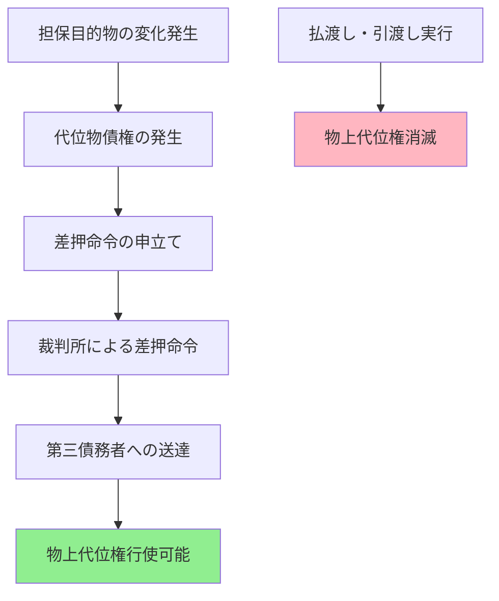

# 物上代位について

---

## スライド1: 物上代位とは

### 定義
- **物上代位（ぶつじょうだいい）**とは、担保目的物が売却・賃貸・滅失等により金銭その他の物に変化した場合に、その変化後の物（代位物）に対しても担保権の効力を及ぼすことができる制度
- 民法304条に規定される抵当権の物上代位が代表例

### 目的
- 担保目的物の変化による担保価値の散逸防止
- 債権者の担保権実行の機会確保
- 担保制度の実効性維持

### 基本的な仕組み
```
担保目的物（不動産）→ 売却 → 売却代金（金銭）
     ↓                        ↓
   抵当権                 抵当権の効力
                        （物上代位）
```

*担保権が目的物の変化に追随して効力を発揮する制度です。*

---

## スライド2: 法的根拠と要件

### 民法304条（抵当権の物上代位）
**条文：**
「抵当権は、その目的物が売却、賃貸、滅失又は損傷によって債務者が受けるべき金銭その他の物に対しても、行使することができる。ただし、その払渡し又は引渡しの前に差押えをしなければならない。」

### 物上代位の成立要件

#### 1. 目的物の変化事由
- **売却**：任意売却・競売による売却
- **賃貸**：目的物を第三者に賃貸すること
- **滅失**：火災・天災等による物理的消滅
- **損傷**：一部破損による価値減少

#### 2. 代位物の発生
- **金銭債権**：売買代金債権、賃料債権、保険金請求権
- **物権**：代替物、修繕による増加部分

#### 3. 差押えの要件
- **時期**：払渡し・引渡し前の差押えが必須
- **対象**：代位物（債権・物）に対する差押え
- **効果**：第三債務者への確定的効力発生

---

## スライド3: 物上代位が認められる範囲

### 抵当権の物上代位（民法304条）

#### 認められる代位物の種類

| 原因 | 代位物 | 具体例 |
|------|--------|--------|
| **売却** | 売買代金債権 | 抵当不動産の任意売却代金 |
| **賃貸** | 賃料債権 | 抵当建物の家賃収入 |
| **滅失** | 保険金請求権 | 火災保険金、地震保険金 |
| **損傷** | 損害賠償請求権 | 修繕費用、慰謝料等 |

#### 実務上重要な判例法理

**1. 賃料債権への物上代位**
- **判例**：最判平成元年10月27日
- **要件**：建物の賃貸借契約締結後の賃料債権
- **範囲**：将来賃料債権も含む（差押え時点で発生確定したもの）

**2. 転用賃料への物上代位**
- **判例**：最判平成11年11月24日
- **内容**：抵当権設定後の賃貸借から生じる賃料債権
- **条件**：賃貸借契約が抵当権に対抗できない場合

### 先取特権の物上代位

#### 一般先取特権（民法306条）
- **適用条文**：民法304条の準用
- **対象債権**：国税・地方税、雇用関係債権等
- **代位物**：債務者の総財産の変化物

#### 特別先取特権の物上代位

**1. 動産保存の先取特権**
- **代位物**：動産の売却代金、保険金
- **具体例**：保管料債権→保管物売却代金

**2. 不動産保存の先取特権**
- **代位物**：不動産の売却代金、損害賠償金
- **具体例**：建築工事代金債権→建物売却代金

---

## スライド4: 物上代位の制限と限界

### 差押えの要件による制限

#### 差押えの必要性（民法304条ただし書）

**目的：**
- 第三債務者の保護
- 債権の帰属関係の明確化
- 他の債権者との優先関係の確定

**具体的手続き：**


#### 差押えの時期的限界

**✅ 有効な差押え**
- 売買代金の買主から売主への支払い前
- 賃料の賃借人から賃貸人への支払い前
- 保険金の保険会社から被保険者への支払い前

**❌ 無効な差押え**
- 既に支払いが完了した後の差押え
- 第三債務者が供託した後の差押え
- 代位物が債務者の一般財産に混入した後

### 抵当権の実行における制限

#### 競売手続きとの関係
- **同時進行**：物上代位権行使と競売手続きの併存可能
- **優先関係**：先に実行した手続きが優先
- **清算関係**：重複部分の調整必要

#### 他の権利者との競合
- **後順位抵当権者**：物上代位の対象から除外
- **一般債権者**：物上代位権者が優先
- **差押債権者**：差押えの先後により決定

---

## スライド5: 具体的事例での理解

### 事例1：建物火災による保険金代位

**状況設定：**
- A所有の建物にB銀行が1億円の抵当権設定
- 建物が火災で全焼（保険金8000万円）
- C保険会社からAへの保険金支払い前にB銀行が差押え

**物上代位の成立過程：**
```
建物（1億円相当）→ 火災で全焼 → 保険金請求権（8000万円）
     ↓                            ↓
   抵当権                    B銀行が差押え
     ↓                            ↓
債権額1億円                  8000万円回収可能
```

**結果：**
- B銀行：保険金8000万円に対して物上代位権行使可能
- 残債権：2000万円（Aの他の財産から回収必要）

### 事例2：賃貸建物の賃料債権への代位

**状況設定：**
- A所有の賃貸マンションにB銀行が抵当権設定
- 月額賃料総額300万円（年額3600万円）
- Aが他の債務で経営困難となり、B銀行が賃料債権を差押え

**物上代位の実行：**
- **対象**：テナントから Aへの賃料支払債権
- **手続き**：各テナント（第三債務者）への差押命令送達
- **効果**：賃料をB銀行に直接支払い（Aを経由せず）

**実務上の注意点：**
- 将来賃料債権の範囲確定
- 賃貸借契約の対抗要件確認
- 管理費・修繕積立金等の控除

### 事例3：任意売却による売買代金代位

**状況設定：**
- A所有の土地（時価5000万円）にB銀行が6000万円の抵当権
- Aが任意売却で4500万円で売却契約成立
- 売買代金支払い前にB銀行が物上代位権行使

**代位権行使の手続き：**
1. **差押申立て**：売買代金債権に対する差押命令申立て
2. **命令送達**：買主（第三債務者）への差押命令送達
3. **取立て**：B銀行が買主から直接4500万円回収
4. **清算**：残債権1500万円はAの他財産から回収

---

## スライド6: 他の制度との比較

### 詐害行為取消権との相違

| 項目 | 物上代位 | 詐害行為取消権 |
|------|----------|----------------|
| **性質** | 担保権の効力拡張 | 責任財産の保全 |
| **要件** | 差押えのみ | 詐害意思・受益者悪意等 |
| **効果** | 代位物への担保権行使 | 行為の取消し |
| **対象** | 担保権者のみ | 一般債権者 |

### 債権者代位権との相違

| 項目 | 物上代位 | 債権者代位権 |
|------|----------|--------------|
| **行使主体** | 担保権者 | 一般債権者 |
| **被保全債権** | 担保権付債権 | 一般債権 |
| **要件** | 差押え | 債務者の無資力等 |
| **効果** | 優先弁済 | 債務者への帰属 |

### 相殺との関係

**物上代位権と相殺の競合問題：**
- **判例法理**：最判平成10年1月30日
- **結論**：相殺の意思表示と差押えの先後により決定
- **理由**：両者とも法律で認められた権利行使

**具体的判定基準：**
1. **差押え先行**：物上代位権が優先
2. **相殺意思表示先行**：相殺が優先
3. **同時**：相殺が優先（債務者保護の観点）

---

## スライド7: 実務上の注意点と限界

### 実務上の課題

#### 1. 差押えのタイミング
**課題：**
- 代位物の発生と消滅の迅速性
- 第三債務者への通知の困難性
- 差押命令の送達遅延リスク

**対策：**
- 担保目的物の状況継続監視
- 代位事由発生時の迅速対応体制構築
- 仮差押えによる保全措置検討

#### 2. 代位物の範囲確定
**課題：**
- 賃料債権の将来分の範囲
- 保険金からの必要費控除
- 売買代金からの諸費用控除

**対策：**
- 契約書等での代位物範囲の事前確認
- 法律専門家との連携による適切な範囲設定
- 清算手続きの透明性確保

#### 3. 他の権利者との調整
**課題：**
- 複数抵当権者間の配当調整
- 税金・公租公課の優先権との関係
- 一般債権者による異議申立て

**対策：**
- 権利関係の事前調査徹底
- 配当手続きの適正実施
- 関係者間の協議による円満解決

### 制度の限界

#### 経済的限界
- **代位物価値の限界**：原物価値を超える回収不可
- **費用対効果**：差押え手続き費用の負担
- **時間的制約**：迅速な手続き実行の必要性

#### 法的限界
- **差押え要件の厳格性**：タイミングの重要性
- **第三債務者保護**：二重払いの危険負担
- **他制度との競合**：相殺・時効等との調整

---

## まとめ

物上代位は担保権の実効性を確保する重要な制度です。

**覚えるポイント：**
- 物上代位 = 担保目的物の変化に追随する担保権の効力
- 民法304条 = 抵当権の物上代位の基本規定
- 差押え要件 = 払渡し・引渡し前の差押えが必須
- 認められる範囲 = 売却・賃貸・滅失・損傷による代位物

**実務での重要性：**
- 不動産担保融資における追加回収手段
- 賃貸不動産の収益確保方法
- 保険事故時の担保価値保全手段

---

## 用語説明

### 基本的な担保法用語

**担保権（たんぽけん）**
- 債権の弁済を確保するために、特定の財産から優先的に弁済を受けることができる権利
- 例：抵当権、質権、先取特権、留置権

**担保目的物（たんぽもくてきぶつ）**
- 担保権の対象となる財産
- 例：抵当権の場合の土地・建物、質権の場合の動産・債権

**物上代位権（ぶつじょうだいいけん）**
- 担保目的物が他の物に変化した場合に、その変化後の物に対して担保権を行使できる権利
- 担保権の効力の拡張として位置づけられる

**代位物（だいいぶつ）**
- 担保目的物が変化した後の物
- 例：売却代金、賃料、保険金、損害賠償金

### 差押えに関する用語

**差押え（さしおさえ）**
- 債務者が財産を処分することを禁止し、強制執行の準備として財産を確保する手続き
- 物上代位では第三債務者への確定的効力発生が目的

**第三債務者（だいさんさいむしゃ）**
- 債務者に対して債務を負っている者
- 物上代位では代位物の給付義務者（買主、賃借人、保険会社等）

**払渡し・引渡し（はらいわたし・ひきわたし）**
- 第三債務者が債務者に対して金銭の支払いや物の引渡しを行うこと
- この前に差押えが必要（民法304条ただし書）

### 抵当権関連用語

**抵当権（ていとうけん）**
- 債務の担保として提供された不動産について、債務が弁済されない場合に、その不動産から優先的に弁済を受けることができる権利
- 占有を移転せずに設定可能な担保権

**抵当権者（ていとうけんしゃ）**
- 抵当権を有する者（通常は債権者）
- 物上代位権の行使主体

**抵当権設定者（ていとうけんせっていしゃ）**
- 抵当権を設定した者（通常は債務者または物上保証人）
- その所有する不動産に抵当権が設定される

**根抵当権（ねていとうけん）**
- 一定の範囲に属する不特定の債権を担保するために設定される抵当権
- 物上代位についても民法398条の20で準用規定

### 優先権に関する用語

**先取特権（さきどりとっけん）**
- 法律の規定により、特定の債権者が他の債権者に先立って弁済を受けることができる権利
- 一般先取特権と特別先取特権に分類

**優先弁済権（ゆうせんべんさいけん）**
- 複数の債権者がいる場合に、特定の債権者が他の債権者より先に弁済を受けることができる権利
- 担保権の本質的効力

**物上保証（ぶつじょうほしょう）**
- 他人の債務の担保として自己の財産に担保権を設定すること
- 物上保証人も物上代位の利益を享受

**競売（けいばい）**
- 裁判所が担保権の実行として担保目的物を強制的に売却する手続き
- 物上代位権行使と競売手続きは併存可能